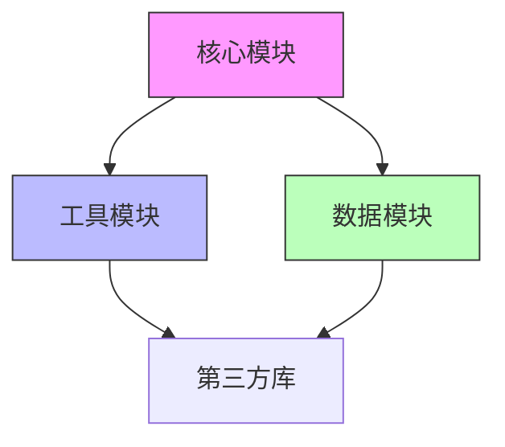

# 代码结构分析技能

深度分析项目代码结构，生成架构洞察报告。基于 mycodemap CLI 提供结构化代码分析，帮助理解项目组织、模块关系、依赖拓扑和设计模式。

## When to Use

- 分析项目代码结构和组织方式
- 理解模块间依赖关系和耦合度
- 识别核心模块和热点代码
- 评估架构健康度和设计质量
- 为重构或优化提供结构洞察

## When NOT to Use

- 简单的代码查询或符号查找
- 单文件分析或代码审查
- 不涉及结构层面的代码修改
- 已有 mycodemap 索引且只需要快速查询（直接用 `mycodemap query`）

## 输出语言

默认中文。如果用户使用其他语言提问，则跟随用户语言。

## 核心原则

### 1. 结构视角优先

从"这个项目如何组织"出发，不是"这个文件里有什么函数"。

| 不要 | 要 |
|------|-----|
| `src/utils/helper.ts` 包含 15 个工具函数 | 工具模块采用扁平结构，按功能域划分，但缺少统一的导出入口 |
| `package.json` 有 20 个依赖 | 依赖分为核心运行时、开发工具、测试框架三类，其中 2 个依赖存在版本冲突 |

### 2. 量化驱动

使用具体指标评估结构质量：
- 模块耦合度（依赖数/模块数）
- 代码集中度（核心模块占比）
- 循环依赖数量
- 复杂度分布

### 3. 设计模式识别

识别项目中的设计模式和架构风格：
- 分层架构 vs 微服务 vs 单体
- 事件驱动 vs 请求响应
- 插件化 vs 硬编码
- 配置驱动 vs 代码驱动

### 4. 健康度评估

评估架构健康度：
- 可维护性：模块职责清晰度、耦合度
- 可扩展性：新功能添加难度
- 可测试性：模块独立性、依赖注入
- 性能：热点代码、瓶颈模块

## 分析工作流

### 阶段 1: 项目初始化与扫描

1. **检测项目类型**：
   - 读取 `package.json`、`pyproject.toml`、`Cargo.toml`、`go.mod` 等识别技术栈
   - 识别项目规模（文件数、代码行数）

2. **mycodemap 初始化**：
   ```bash
   # 检查 mycodemap 可用性
   if command -v mycodemap &> /dev/null; then
       CODEMAP="mycodemap"
   elif [ -f "./node_modules/.bin/mycodemap" ]; then
       CODEMAP="./node_modules/.bin/mycodemap"
   else
       CODEMAP="npx @mycodemap/mycodemap"
   fi

   # 生成代码地图
   $CODEMAP generate
   ```

3. **读取代码地图**：
   - 阅读 `.mycodemap/AI_MAP.md` 获取项目概览
   - 阅读 `.mycodemap/CONTEXT.md` 获取上下文信息

### 阶段 2: 结构特征识别

1. **目录结构分析**：
   - 识别顶层目录职责（src、lib、test、config 等）
   - 分析目录深度和嵌套模式
   - 识别特殊目录（monorepo、workspace 等）

2. **模块边界识别**：
   - 基于目录结构识别逻辑模块
   - 基于导出/导入关系识别模块边界
   - 识别核心模块和辅助模块

3. **依赖拓扑分析**：
   ```bash
   # 查看模块依赖
   $CODEMAP deps -m "<module-path>"

   # 检测循环依赖
   $CODEMAP cycles

   # 查看依赖图
   $CODEMAP deps -j
   ```

4. **复杂度热点识别**：
   ```bash
   # 查看复杂度分布
   $CODEMAP complexity

   # 查看特定文件复杂度
   $CODEMAP complexity -f "<file-path>"
   ```

### 阶段 3: 深度结构分析

1. **核心模块分析**：
   - 识别项目核心模块（依赖最多、调用最频繁）
   - 分析核心模块的职责和接口
   - 评估核心模块的设计质量

2. **依赖关系分析**：
   - 识别依赖方向（上层依赖下层 vs 循环依赖）
   - 分析依赖稳定性（抽象 vs 具体）
   - 检测依赖异味（循环依赖、过深依赖链）

3. **接口设计分析**：
   - 识别模块公共接口
   - 分析接口一致性和命名规范
   - 评估接口粒度和职责单一性

4. **配置驱动分析**：
   - 识别配置文件和配置模式
   - 分析配置与代码的分离程度
   - 评估配置的灵活性和可维护性

### 阶段 4: 架构健康度评估

1. **可维护性评估**：
   - 模块职责清晰度
   - 代码重复度
   - 文档完整性

2. **可扩展性评估**：
   - 新功能添加难度
   - 插件化程度
   - 配置灵活性

3. **可测试性评估**：
   - 模块独立性
   - 依赖注入程度
   - 测试覆盖率

4. **性能风险评估**：
   - 热点代码识别
   - 瓶颈模块分析
   - 资源消耗模式

### 阶段 5: 报告生成

1. **结构概览**：
   - 项目规模和技术栈
   - 目录结构和组织模式
   - 核心模块识别

2. **依赖拓扑**：
   - 模块依赖图（Mermaid）
   - 循环依赖报告
   - 依赖稳定性分析

3. **设计模式**：
   - 识别的架构模式
   - 设计决策分析
   - 模式适用性评估

4. **健康度报告**：
   - 可维护性评分
   - 可扩展性评分
   - 可测试性评分
   - 性能风险标记

5. **改进建议**：
   - 结构优化建议
   - 重构优先级
   - 技术债务标记

## 输出格式

### 结构分析报告

```markdown
# 项目结构分析报告

## 1. 项目概览
- 技术栈：[语言、框架、工具]
- 规模：[文件数、代码行数、模块数]
- 组织模式：[monorepo/multi-package/single-package]

## 2. 目录结构
[目录树图 + 职责说明]

## 3. 模块拓扑
[Mermaid 依赖图]

## 4. 核心模块分析
[模块清单 + 职责 + 接口 + 设计质量]

## 5. 依赖分析
- 循环依赖：[数量 + 位置]
- 依赖深度：[最大深度 + 分布]
- 依赖稳定性：[抽象/具体比例]

## 6. 架构健康度
- 可维护性：[评分 + 说明]
- 可扩展性：[评分 + 说明]
- 可测试性：[评分 + 说明]
- 性能风险：[标记 + 说明]

## 7. 设计模式
[识别的模式 + 适用性评估]

## 8. 改进建议
[优化建议 + 优先级 + 技术债务]
```

### 依赖图格式



## 特殊场景处理

### 大型项目（>10000 行）

1. 分层分析：先顶层模块，再子模块
2. 聚焦核心：优先分析核心模块
3. 并行分析：使用 Agent 工具并行分析多个模块

### Monorepo 项目

1. 识别 workspace 结构
2. 分析包间依赖
3. 评估共享代码策略

### 遗留项目

1. 识别技术债务
2. 标记过时依赖
3. 评估现代化路径

## mycodemap 集成

### 常用命令

```bash
# 生成代码地图
mycodemap generate

# 查询符号
mycodemap query -s "<symbol-name>"
mycodemap query -s "<symbol-name>" -j  # JSON 输出

# 查询模块
mycodemap query -m "<module-path>"

# 依赖分析
mycodemap deps -m "<module-path>"
mycodemap deps -m "<module-path>" -j

# 影响分析
mycodemap impact -f "<file-path>"
mycodemap impact -f "<file-path>" --transitive

# 循环依赖检测
mycodemap cycles

# 复杂度分析
mycodemap complexity
mycodemap complexity -f "<file-path>"
mycodemap complexity --top  # 最复杂文件
```

### 分析策略

1. **自顶向下**：先整体结构，再具体模块
2. **依赖驱动**：从依赖关系入手，理解模块职责
3. **热点聚焦**：优先分析复杂度高的模块
4. **接口优先**：先看公共接口，再看实现细节

## 质量标准

### 报告质量

1. **量化指标**：使用具体数字而非模糊描述
2. **可视化**：大量使用 Mermaid 图表
3. **可操作**：建议具体、可执行
4. **证据支撑**：所有结论有代码依据

### 分析深度

1. **核心模块**：深入分析职责、接口、设计质量
2. **辅助模块**：概述职责和依赖关系
3. **第三方依赖**：版本、许可证、维护状态
4. **配置文件**：结构、灵活性、安全性

## 参考文档

- [mycodemap 使用指南](references/mycodemap-guide.md)
- [架构评估框架](references/architecture-evaluation.md)
- [设计模式识别](references/design-patterns.md)
