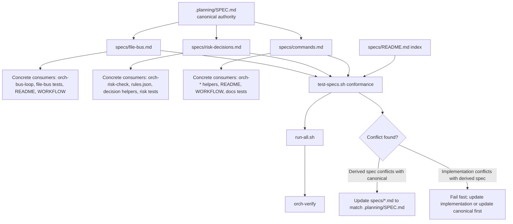

# Phase 15: Specification System - Research

**Researched:** 2026-04-28  
**Domain:** Derived specification documentation, conformance smoke tests, canonical spec governance  
**Confidence:** HIGH

<user_constraints>
## User Constraints (from CONTEXT.md)

Source for this section: `.planning/phases/15-specification-system/15-CONTEXT.md`. [VERIFIED: .planning/phases/15-specification-system/15-CONTEXT.md]

### Phase Boundary

Phase 15 establishes a `specs/` derived specification system while preserving `.planning/SPEC.md` as the canonical specification. This phase creates only derived specs with current consumers, defines how each derived spec declares source/consumer/drift/conformance metadata, and adds failing conformance checks for those specs. It does not add runtime capabilities, remote adapters, or Makefile workflow targets.

### Locked Decisions

#### Derived Spec Inventory and Consumers
- **D-01:** Use a minimum effective derived spec inventory: create only specs that have current repository consumers.
- **D-02:** Create `specs/file-bus.md`. Current consumers are `docs/orchestra/scripts/bin/orch-bus-loop`, file-bus smoke tests, `docs/orchestra/README.md`, and `docs/orchestra/WORKFLOW.md`.
- **D-03:** Create `specs/risk-decisions.md`. Current consumers are `docs/orchestra/scripts/bin/orch-risk-check`, `docs/orchestra/config/rules.json`, decision CLI helpers, and risk/decision smoke tests.
- **D-04:** Create `specs/commands.md`. Current consumers are `orch-*` scripts, `docs/orchestra/README.md`, `docs/orchestra/WORKFLOW.md`, and docs smoke tests.
- **D-05:** Create `specs/README.md` as the index for derived specs and their consumers.

#### Spec File Shape and Metadata
- **D-06:** Each derived spec uses fixed Markdown sections: `## Source`, `## Consumers`, `## Drift Check`, and `## Conformance Checks`.
- **D-07:** Each derived spec points to relevant `.planning/SPEC.md` sections as the primary source. `docs/orchestra/*` documents may be cited as implementation projections, not as competing authorities.
- **D-08:** Consumers must be listed as concrete file paths. Categories may be added for readability, but concrete paths are authoritative.
- **D-09:** Derived specs should extract only downstream-required, checkable contracts. They should not duplicate the full canonical specification.

#### Conformance Checks
- **D-10:** Add `docs/orchestra/scripts/tests/test-specs.sh` for derived spec conformance checks.
- **D-11:** Rely on existing `docs/orchestra/scripts/tests/run-all.sh` discovery so `orch-verify` reaches `test-specs.sh`.
- **D-12:** For every derived spec, the test must fail if required fixed sections are missing, the primary source does not point to `.planning/SPEC.md`, a listed concrete consumer path does not exist, a drift check command is missing, or no conformance check is listed.
- **D-13:** `specs/README.md` must index every `specs/*.md` file and list its consumers. Tests should fail if a spec file is not indexed.
- **D-14:** Do not add Makefile targets in Phase 15. Phase 16 owns Makefile creation; Phase 15 only ensures the existing smoke runner can execute spec checks.

#### Canonical Conflict Handling
- **D-15:** `.planning/SPEC.md` always wins over `specs/*.md`.
- **D-16:** `specs/*.md` files are projections, not authorities. If a derived spec conflicts with `.planning/SPEC.md`, update the derived spec to match canonical.
- **D-17:** If implementation code conflicts with a derived spec, conformance checks should fail fast and point to either updating the implementation or updating canonical first and then regenerating/revising the derived spec.
- **D-18:** If `.planning/SPEC.md` is stale or missing v1.2 detail, Phase 15 should not perform broad canonical rewrites. Record a deferred follow-up or make only the smallest necessary reference clarification.
- **D-19:** Downstream agents should read in this order: `.planning/SPEC.md`, then relevant `specs/*.md`, then `docs/orchestra/*` implementation projections.

### Claude's Discretion

- Exact wording and section ordering inside each derived spec, as long as the fixed required sections exist.
- Exact grep/Python/Bash implementation details of `test-specs.sh`.
- Exact drift check command text, provided it is concrete and can fail.
- Exact grouping in `specs/README.md`, provided every spec file is indexed with concrete consumers.

### Deferred Ideas (OUT OF SCOPE)

- Full split of all major `.planning/SPEC.md` sections is deferred until concrete consumers exist.
- Makefile targets for spec checks are deferred to Phase 16.
- Broad `.planning/SPEC.md` rewrites for v1.2 detail gaps are deferred unless a later phase explicitly scopes them.
</user_constraints>

<phase_requirements>
## Phase Requirements

| ID | Description | Research Support |
|----|-------------|------------------|
| SPEC-01 | `.planning/SPEC.md` 保持 canonical spec；任何 `specs/*.md` 派生文件必须声明 source、consumer 和 drift check。 [VERIFIED: .planning/REQUIREMENTS.md] | Use `.planning/SPEC.md` as the only primary source, create only `specs/file-bus.md`, `specs/risk-decisions.md`, `specs/commands.md`, and require `## Source`, `## Consumers`, `## Drift Check` in each derived spec. [VERIFIED: .planning/phases/15-specification-system/15-CONTEXT.md; .planning/SPEC.md] |
| SPEC-02 | 每个派生 spec 至少有一个可失败的 conformance check；没有当前 consumer 的 spec 不得创建。 [VERIFIED: .planning/REQUIREMENTS.md] | Add `docs/orchestra/scripts/tests/test-specs.sh`, let existing `run-all.sh` discover it, and make it fail on missing sections, missing `.planning/SPEC.md` source, missing consumer paths, missing drift command, missing conformance check, or unindexed spec files. [VERIFIED: .planning/phases/15-specification-system/15-CONTEXT.md; docs/orchestra/scripts/tests/run-all.sh] |
</phase_requirements>

## Project Constraints (from CLAUDE.md)

- Respond in Simplified Chinese for user-facing messages. [VERIFIED: CLAUDE.md; AGENTS.md]
- Prefer retrieval-led reasoning over pre-training-led reasoning. [VERIFIED: CLAUDE.md; AGENTS.md]
- Keep implementation minimal, avoid speculative features, and do not add abstractions for single-use code. [VERIFIED: CLAUDE.md; AGENTS.md]
- Touch only files required by the requested work and match existing style. [VERIFIED: CLAUDE.md; AGENTS.md]
- Preserve the spec-first boundary: contracts, schemas, scenarios, and roadmap steps precede code. [VERIFIED: AGENTS.md]
- Keep changes focused on `.planning/` unless implementation work is explicitly requested; Phase 15 planning output belongs under `.planning/phases/15-specification-system/`. [VERIFIED: AGENTS.md; user prompt]
- `.planning/SPEC.md` is canonical for planning artifacts, while `docs/orchestra/` is the implementation projection. [VERIFIED: AGENTS.md; .planning/phases/15-specification-system/15-CONTEXT.md]
- Do not modify `gbrain/`, upstream `NousResearch/hermes-agent` core code, or `~/.hermes-orchestra/rules.json` in this project. [VERIFIED: AGENTS.md]

## Summary

Phase 15 should be planned as a documentation-and-test phase, not a runtime feature phase. The canonical source remains `.planning/SPEC.md`; the new `specs/` files are narrow, consumer-oriented projections that make specific contracts easier for downstream implementation and tests to read. [VERIFIED: .planning/phases/15-specification-system/15-CONTEXT.md; .planning/SPEC.md]

The minimum effective deliverable is four new docs plus one new smoke test: `specs/README.md`, `specs/file-bus.md`, `specs/risk-decisions.md`, `specs/commands.md`, and `docs/orchestra/scripts/tests/test-specs.sh`. `docs/orchestra/scripts/tests/run-all.sh` already discovers `test-*.sh`, and `docs/orchestra/scripts/bin/orch-verify` already delegates to that runner, so Phase 15 should not add Makefile wiring or a new test framework. [VERIFIED: .planning/phases/15-specification-system/15-CONTEXT.md; docs/orchestra/scripts/tests/run-all.sh; docs/orchestra/scripts/bin/orch-verify]

**Primary recommendation:** implement a small, explicit Markdown contract system backed by one Bash smoke test using the existing `assert.sh` helpers and Python standard library parsing only where Bash would become brittle. [VERIFIED: docs/orchestra/scripts/tests/lib/assert.sh; docs/orchestra/scripts/tests/test-file-bus.sh; docs/orchestra/scripts/tests/test-risk-decisions.sh]

## Architectural Responsibility Map

| Capability | Primary Tier | Secondary Tier | Rationale |
|------------|--------------|----------------|-----------|
| Canonical specification authority | `.planning/SPEC.md` | `specs/*.md` projections | `.planning/SPEC.md` is the canonical spec and derived specs must point back to it as source. [VERIFIED: .planning/phases/15-specification-system/15-CONTEXT.md; AGENTS.md] |
| File bus contract projection | `specs/file-bus.md` | `orch-bus-loop`, file-bus tests, README, WORKFLOW | The file-bus contract is defined in `.planning/SPEC.md` §§BUS-01..06 and consumed by the bus loop, smoke tests, and docs projections. [VERIFIED: .planning/SPEC.md; .planning/phases/15-specification-system/15-CONTEXT.md] |
| Risk and decision contract projection | `specs/risk-decisions.md` | `orch-risk-check`, `rules.json`, decision helpers, risk tests | Risk floors, L3/L4 blocking, fallback decisions, and decision envelope contracts are defined in `.planning/SPEC.md` §§AUTH-03, RISK-01..05, REMOTE-05, Appendix A, and Appendix B. [VERIFIED: .planning/SPEC.md; docs/orchestra/config/rules.json; docs/orchestra/scripts/bin/orch-risk-check] |
| Command contract projection | `specs/commands.md` | `docs/orchestra/scripts/bin/orch-*`, README, WORKFLOW, docs tests | Command contracts are specified in `.planning/SPEC.md` §§CMD-01..02 and projected through local `orch-*` helper scripts and docs. [VERIFIED: .planning/SPEC.md; docs/orchestra/scripts/bin; docs/orchestra/README.md; docs/orchestra/WORKFLOW.md] |
| Conformance verification | `docs/orchestra/scripts/tests/test-specs.sh` | `run-all.sh`, `orch-verify` | Existing smoke discovery runs every `test-*.sh`, and `orch-verify` executes the package runner when present. [VERIFIED: docs/orchestra/scripts/tests/run-all.sh; docs/orchestra/scripts/bin/orch-verify] |

## Standard Stack

### Core

| Library / Tool | Version | Purpose | Why Standard |
|----------------|---------|---------|--------------|
| Markdown files | n/a | Human-readable derived specs under `specs/` | Existing project artifacts are Markdown and Phase 15 explicitly creates `specs/*.md`. [VERIFIED: .planning/phases/15-specification-system/15-CONTEXT.md; .planning/REQUIREMENTS.md] |
| Bash | 5.2.21 | Smoke test entrypoint and assertions | Existing tests are Bash scripts with `set -euo pipefail`. [VERIFIED: bash --version; docs/orchestra/scripts/tests/*.sh] |
| Python 3 standard library | 3.12.3 | Small structured parsing inside shell tests | Existing scripts already use Python for JSON parsing and test assertions where shell parsing is brittle. [VERIFIED: python3 --version; docs/orchestra/scripts/tests/lib/assert.sh; docs/orchestra/scripts/lib/orch-common.sh] |
| `docs/orchestra/scripts/tests/lib/assert.sh` | repo-local | Shared smoke-test assertions | Existing tests source this helper and use `assert_contains`, `assert_file_exists`, `assert_exit_code`, and `fail`. [VERIFIED: docs/orchestra/scripts/tests/lib/assert.sh; docs/orchestra/scripts/tests/test-docs.sh] |
| `docs/orchestra/scripts/tests/run-all.sh` | repo-local | Smoke test discovery | It loops over `test-*.sh` in the tests directory and runs each with `bash`. [VERIFIED: docs/orchestra/scripts/tests/run-all.sh] |

### Supporting

| Library / Tool | Version | Purpose | When to Use |
|----------------|---------|---------|-------------|
| `grep` | 3.11 | Fixed string checks in shell tests | Use for simple `assert_contains` style checks. [VERIFIED: grep --version; docs/orchestra/scripts/tests/lib/assert.sh] |
| `find` | 4.9.0 | Enumerating `specs/*.md` and test files | Use for file discovery when glob edge cases need stable handling. [VERIFIED: find --version; docs/orchestra/scripts/tests/run-all.sh] |
| `git` | 2.43.0 | Optional repository evidence during validation | Existing project validation relies on direct repository evidence, and this phase can use `git status` after edits. [VERIFIED: git --version; .planning/SPEC.md §EVID-02] |

### Alternatives Considered

| Instead of | Could Use | Tradeoff |
|------------|-----------|----------|
| Bash + Python stdlib smoke test | External Markdown parser or test framework | Adds dependencies for a documentation-only phase while existing project tests are pure Bash. [VERIFIED: docs/orchestra/scripts/tests/*.sh; .planning/phases/15-specification-system/15-CONTEXT.md] |
| Existing `run-all.sh` discovery | New Makefile target | Makefile work is explicitly deferred to Phase 16. [VERIFIED: .planning/phases/15-specification-system/15-CONTEXT.md; .planning/ROADMAP.md] |
| Narrow derived specs | Full split of all `.planning/SPEC.md` sections | Full split is deferred until concrete consumers exist. [VERIFIED: .planning/phases/15-specification-system/15-CONTEXT.md] |

**Installation:**
```bash
# No package installation is required for Phase 15.
# Use the existing repository scripts and system Bash/Python.
```
[VERIFIED: docs/orchestra/scripts/tests/*.sh; bash --version; python3 --version]

**Version verification:** No npm packages are recommended. Tool versions were verified locally with `bash --version`, `python3 --version`, `git --version`, `grep --version`, and `find --version`. [VERIFIED: local environment audit]

## Architecture Patterns

### System Architecture Diagram


[VERIFIED: .planning/phases/15-specification-system/15-CONTEXT.md; docs/orchestra/scripts/tests/run-all.sh; docs/orchestra/scripts/bin/orch-verify]

### Recommended Project Structure

```text
specs/
├── README.md              # derived spec index and authority relationship
├── file-bus.md            # derived file-bus contract
├── risk-decisions.md      # derived risk/decision contract
└── commands.md            # derived command contract

docs/orchestra/scripts/tests/
└── test-specs.sh          # derived spec conformance smoke test
```
[VERIFIED: .planning/phases/15-specification-system/15-CONTEXT.md]

### Component Responsibilities

| File | Responsibility | Source Basis |
|------|----------------|--------------|
| `specs/README.md` | Index every derived spec, state `.planning/SPEC.md` remains canonical, and list concrete consumers for each spec. | D-05 and D-13 require an index and indexing checks. [VERIFIED: .planning/phases/15-specification-system/15-CONTEXT.md] |
| `specs/file-bus.md` | Extract checkable contracts for bus file names, envelope fields, writer/reader ownership, atomic/archive behavior, and projection-vs-canonical rules. | `.planning/SPEC.md` §§BUS-01..06 define these contracts. [VERIFIED: .planning/SPEC.md] |
| `specs/risk-decisions.md` | Extract checkable contracts for L3/L4 blocking, static rule floors, local fallback decisions, one-time approvals, and decision envelope fields. | `.planning/SPEC.md` §§AUTH-03, RISK-01..05, REMOTE-05, Appendix A, and Appendix B define these contracts. [VERIFIED: .planning/SPEC.md] |
| `specs/commands.md` | Extract checkable contracts for local command surface and command behavior without adding new commands. | `.planning/SPEC.md` §§CMD-01..02 define command contracts, and `docs/orchestra/scripts/bin/` contains the local `orch-*` entrypoints. [VERIFIED: .planning/SPEC.md; docs/orchestra/scripts/bin] |
| `docs/orchestra/scripts/tests/test-specs.sh` | Fail on missing derived spec metadata, missing concrete consumer paths, missing index entries, and missing conformance listings. | D-10..D-13 define the required conformance behavior, and existing tests show the Bash/assert pattern. [VERIFIED: .planning/phases/15-specification-system/15-CONTEXT.md; docs/orchestra/scripts/tests/lib/assert.sh] |

### Pattern 1: Narrow Derived Projection

**What:** Each derived spec should summarize only the downstream-required, checkable contract and cite `.planning/SPEC.md` sections in `## Source`. [VERIFIED: .planning/phases/15-specification-system/15-CONTEXT.md]

**When to use:** Use for `file-bus`, `risk-decisions`, and `commands`, because each has current repository consumers. [VERIFIED: .planning/phases/15-specification-system/15-CONTEXT.md]

**Example:**
```markdown
## Source

- Primary: `.planning/SPEC.md` §§BUS-01..BUS-06.
- Projection only: `docs/orchestra/README.md`, `docs/orchestra/WORKFLOW.md`.
```
[VERIFIED: .planning/SPEC.md; .planning/phases/15-specification-system/15-CONTEXT.md]

### Pattern 2: Concrete Consumer Paths

**What:** List one concrete repository path per consumer bullet, preferably inside backticks so `test-specs.sh` can extract paths deterministically. [VERIFIED: .planning/phases/15-specification-system/15-CONTEXT.md]

**When to use:** Use under every derived spec's `## Consumers` section and under `specs/README.md` index entries. [VERIFIED: .planning/phases/15-specification-system/15-CONTEXT.md]

**Example:**
```markdown
## Consumers

- `docs/orchestra/scripts/bin/orch-bus-loop` - routes file-bus messages.
- `docs/orchestra/scripts/tests/test-file-bus.sh` - smoke-tests bus routing.
```
[VERIFIED: .planning/phases/15-specification-system/15-CONTEXT.md; docs/orchestra/scripts/bin/orch-bus-loop; docs/orchestra/scripts/tests/test-file-bus.sh]

### Pattern 3: Existing Smoke Runner Integration

**What:** Add a single `test-specs.sh` under `docs/orchestra/scripts/tests/`; `run-all.sh` will pick it up because it runs every `test-*.sh`. [VERIFIED: docs/orchestra/scripts/tests/run-all.sh]

**When to use:** Use for all Phase 15 validation so `orch-verify` reaches the new checks without Makefile work. [VERIFIED: docs/orchestra/scripts/bin/orch-verify; .planning/phases/15-specification-system/15-CONTEXT.md]

**Example:**
```bash
#!/usr/bin/env bash
set -euo pipefail

TEST_NAME="specs-contract"
TEST_DIR="$(cd "$(dirname "${BASH_SOURCE[0]}")" && pwd)"
REPO_ROOT="$(cd "$TEST_DIR/../../../.." && pwd)"

# shellcheck source=lib/assert.sh
source "$TEST_DIR/lib/assert.sh"
```
[VERIFIED: docs/orchestra/scripts/tests/test-docs.sh; docs/orchestra/scripts/tests/test-file-bus.sh]

### Anti-Patterns to Avoid

- **Creating specs without consumers:** This violates SPEC-02 and D-01. [VERIFIED: .planning/REQUIREMENTS.md; .planning/phases/15-specification-system/15-CONTEXT.md]
- **Treating `specs/*.md` as canonical:** `.planning/SPEC.md` wins on conflict. [VERIFIED: .planning/phases/15-specification-system/15-CONTEXT.md; AGENTS.md]
- **Adding Makefile targets:** Makefile work belongs to Phase 16. [VERIFIED: .planning/phases/15-specification-system/15-CONTEXT.md; .planning/ROADMAP.md]
- **Duplicating the whole canonical spec:** Derived specs should extract downstream-required contracts only. [VERIFIED: .planning/phases/15-specification-system/15-CONTEXT.md]
- **Relying on prose-only review:** SPEC-02 requires at least one failing conformance check per derived spec. [VERIFIED: .planning/REQUIREMENTS.md]

## Don't Hand-Roll

| Problem | Don't Build | Use Instead | Why |
|---------|-------------|-------------|-----|
| Test framework | A new test harness or Makefile target | Existing Bash smoke runner and `assert.sh` | Existing `run-all.sh` and `orch-verify` already provide the path. [VERIFIED: docs/orchestra/scripts/tests/run-all.sh; docs/orchestra/scripts/bin/orch-verify] |
| Markdown processing | A general Markdown parser/generator | Fixed sections plus backticked path extraction | Phase requires fixed sections and concrete paths, not full Markdown semantics. [VERIFIED: .planning/phases/15-specification-system/15-CONTEXT.md] |
| Specification authority | A second canonical spec tree | `.planning/SPEC.md` with derived `specs/*.md` projections | Context locks `.planning/SPEC.md` as winner on conflict. [VERIFIED: .planning/phases/15-specification-system/15-CONTEXT.md] |
| Runtime validation | New runtime commands or remote adapters | Documentation conformance only | Phase boundary excludes runtime capabilities and remote adapters. [VERIFIED: .planning/phases/15-specification-system/15-CONTEXT.md] |
| Workflow targets | `make spec-check` or new make tasks | `bash docs/orchestra/scripts/tests/test-specs.sh` and `orch-verify` | Phase 16 owns Makefile creation. [VERIFIED: .planning/phases/15-specification-system/15-CONTEXT.md; .planning/ROADMAP.md] |

**Key insight:** the correct unit of work is a small derived contract plus a failing smoke assertion, not a new specification generation subsystem. [VERIFIED: .planning/phases/15-specification-system/15-CONTEXT.md; docs/orchestra/scripts/tests/*.sh]

## Common Pitfalls

### Pitfall 1: Over-Splitting `.planning/SPEC.md`
**What goes wrong:** A planner creates many `specs/*.md` files for all canonical sections. [VERIFIED: .planning/SPEC.md; .planning/phases/15-specification-system/15-CONTEXT.md]  
**Why it happens:** The repository has many canonical sections, but Phase 15 only authorizes specs with current consumers. [VERIFIED: .planning/SPEC.md; .planning/phases/15-specification-system/15-CONTEXT.md]  
**How to avoid:** Create only `file-bus.md`, `risk-decisions.md`, `commands.md`, and `README.md`. [VERIFIED: .planning/phases/15-specification-system/15-CONTEXT.md]  
**Warning signs:** New specs for recovery, observability, scheduling, or remote adapters appear without a concrete current consumer. [VERIFIED: .planning/SPEC.md; .planning/phases/15-specification-system/15-CONTEXT.md]

### Pitfall 2: Making Docs the Authority
**What goes wrong:** `docs/orchestra/*` or `specs/*.md` is written as if it can override `.planning/SPEC.md`. [VERIFIED: AGENTS.md; .planning/phases/15-specification-system/15-CONTEXT.md]  
**Why it happens:** `docs/orchestra/README.md` and `WORKFLOW.md` contain detailed implementation projections. [VERIFIED: docs/orchestra/README.md; docs/orchestra/WORKFLOW.md]  
**How to avoid:** Put `.planning/SPEC.md` in every `## Source` section and state docs are projections. [VERIFIED: .planning/phases/15-specification-system/15-CONTEXT.md]  
**Warning signs:** A derived spec cites only `docs/orchestra/*` or describes a conflict process where derived docs win. [VERIFIED: .planning/phases/15-specification-system/15-CONTEXT.md]

### Pitfall 3: Non-Failing Conformance
**What goes wrong:** `test-specs.sh` only prints reminders and cannot fail. [VERIFIED: .planning/REQUIREMENTS.md]  
**Why it happens:** Documentation checks are easy to leave as manual review. [ASSUMED]  
**How to avoid:** Use `fail`, `assert_contains`, and explicit non-zero exits for every required invariant. [VERIFIED: docs/orchestra/scripts/tests/lib/assert.sh; .planning/phases/15-specification-system/15-CONTEXT.md]  
**Warning signs:** Missing `set -euo pipefail`, missing `source "$TEST_DIR/lib/assert.sh"`, or no negative branch. [VERIFIED: docs/orchestra/scripts/tests/*.sh]

### Pitfall 4: Parser Fragility
**What goes wrong:** The conformance test cannot reliably distinguish consumer paths from prose. [ASSUMED]  
**Why it happens:** Free-form Markdown is flexible, but the test needs deterministic extraction. [ASSUMED]  
**How to avoid:** Standardize consumer bullets as backticked repo-relative paths and parse only the `## Consumers` section. [VERIFIED: .planning/phases/15-specification-system/15-CONTEXT.md]  
**Warning signs:** Consumer paths are embedded in paragraphs, headings, or comma-separated prose. [ASSUMED]

### Pitfall 5: Makefile Scope Creep
**What goes wrong:** Phase 15 adds Makefile targets or plans dev workflow commands. [VERIFIED: .planning/phases/15-specification-system/15-CONTEXT.md]  
**Why it happens:** Phase 16 depends on Phase 15 and is about Makefile workflow. [VERIFIED: .planning/ROADMAP.md]  
**How to avoid:** Validate through the existing `run-all.sh` and `orch-verify` path only. [VERIFIED: docs/orchestra/scripts/tests/run-all.sh; docs/orchestra/scripts/bin/orch-verify]

## Concrete File Plan Inputs

| Action | File | Required Content / Check |
|--------|------|--------------------------|
| Create | `specs/README.md` | Index `file-bus.md`, `risk-decisions.md`, and `commands.md`; state `.planning/SPEC.md` is canonical; list consumers for each spec. [VERIFIED: .planning/phases/15-specification-system/15-CONTEXT.md] |
| Create | `specs/file-bus.md` | Include `## Source`, `## Consumers`, `## Drift Check`, `## Conformance Checks`; source `.planning/SPEC.md` §§BUS-01..06; list file-bus consumers. [VERIFIED: .planning/SPEC.md; .planning/phases/15-specification-system/15-CONTEXT.md] |
| Create | `specs/risk-decisions.md` | Include fixed sections; source `.planning/SPEC.md` §§AUTH-03, RISK-01..05, REMOTE-05, Appendix A, Appendix B; list risk and decision consumers. [VERIFIED: .planning/SPEC.md; .planning/phases/15-specification-system/15-CONTEXT.md] |
| Create | `specs/commands.md` | Include fixed sections; source `.planning/SPEC.md` §§CMD-01..02 and relevant runtime path/observability sections; list `orch-*` command consumers and docs tests. [VERIFIED: .planning/SPEC.md; docs/orchestra/scripts/bin; .planning/phases/15-specification-system/15-CONTEXT.md] |
| Create | `docs/orchestra/scripts/tests/test-specs.sh` | Follow existing Bash smoke pattern; fail on missing metadata, missing `.planning/SPEC.md` source, nonexistent concrete consumer path, missing drift command, missing conformance check, and unindexed spec. [VERIFIED: docs/orchestra/scripts/tests/*.sh; .planning/phases/15-specification-system/15-CONTEXT.md] |
| Do not modify | Makefile | Phase 16 owns Makefile creation. [VERIFIED: .planning/phases/15-specification-system/15-CONTEXT.md; .planning/ROADMAP.md] |

## Code Examples

Verified patterns from local sources:

### `test-specs.sh` Structure

```bash
#!/usr/bin/env bash
set -euo pipefail

TEST_NAME="specs-contract"
TEST_DIR="$(cd "$(dirname "${BASH_SOURCE[0]}")" && pwd)"
REPO_ROOT="$(cd "$TEST_DIR/../../../.." && pwd)"

# shellcheck source=lib/assert.sh
source "$TEST_DIR/lib/assert.sh"

SPECS_DIR="$REPO_ROOT/specs"
SPEC_INDEX="$SPECS_DIR/README.md"

assert_file_exists "$SPEC_INDEX" "specs index missing"
assert_contains ".planning/SPEC.md" "$SPEC_INDEX" "specs index must state canonical source"

for spec in "$SPECS_DIR"/*.md; do
    [ "$(basename "$spec")" = "README.md" ] && continue
    assert_contains "## Source" "$spec" "spec missing Source section"
    assert_contains "## Consumers" "$spec" "spec missing Consumers section"
    assert_contains "## Drift Check" "$spec" "spec missing Drift Check section"
    assert_contains "## Conformance Checks" "$spec" "spec missing Conformance Checks section"
    assert_contains ".planning/SPEC.md" "$spec" "spec must cite canonical SPEC.md"
    assert_contains "$(basename "$spec")" "$SPEC_INDEX" "spec not indexed"
done

test_done
```
[VERIFIED: docs/orchestra/scripts/tests/test-docs.sh; docs/orchestra/scripts/tests/lib/assert.sh; .planning/phases/15-specification-system/15-CONTEXT.md]

### Consumer Path Extraction Strategy

```bash
python3 - "$REPO_ROOT" "$spec" <<'PY'
import os
import re
import sys

repo_root, spec_path = sys.argv[1:]
text = open(spec_path, encoding="utf-8").read()
match = re.search(r"^## Consumers\n(?P<body>.*?)(?=^## |\Z)", text, re.M | re.S)
if not match:
    raise SystemExit(f"missing Consumers section: {spec_path}")

paths = re.findall(r"`([^`]+)`", match.group("body"))
if not paths:
    raise SystemExit(f"no concrete consumer paths: {spec_path}")

for path in paths:
    if path.startswith("/") or ".." in path.split("/"):
        raise SystemExit(f"consumer path must be repo-relative: {path}")
    if not os.path.exists(os.path.join(repo_root, path)):
        raise SystemExit(f"consumer path missing: {path}")
PY
```
[VERIFIED: docs/orchestra/scripts/tests/lib/assert.sh; .planning/phases/15-specification-system/15-CONTEXT.md]

### Index Completeness Check

```bash
for spec in "$SPECS_DIR"/*.md; do
    [ "$(basename "$spec")" = "README.md" ] && continue
    assert_contains "$(basename "$spec")" "$SPEC_INDEX" "spec file is not indexed"
done
```
[VERIFIED: .planning/phases/15-specification-system/15-CONTEXT.md; docs/orchestra/scripts/tests/lib/assert.sh]

## State of the Art

| Old Approach | Current Approach | When Changed | Impact |
|--------------|------------------|--------------|--------|
| `docs/orchestra/README.md` and `WORKFLOW.md` act as detailed projections without a separate derived spec index. | Phase 15 introduces `specs/README.md` plus three derived specs with source/consumer/drift/conformance metadata. | Phase 15 context gathered 2026-04-28. [VERIFIED: .planning/phases/15-specification-system/15-CONTEXT.md] | Planner can assign concrete doc/test tasks without changing canonical authority. [VERIFIED: .planning/phases/15-specification-system/15-CONTEXT.md] |
| Existing smoke tests cover docs, file bus, risk checks, risk decisions, and decision CLI. | `test-specs.sh` should add derived-spec conformance to the same runner. | Phase 15 implementation. [VERIFIED: docs/orchestra/scripts/tests/*.sh; .planning/ROADMAP.md] | `orch-verify` reaches spec checks through existing runner delegation. [VERIFIED: docs/orchestra/scripts/bin/orch-verify; docs/orchestra/scripts/tests/run-all.sh] |
| Makefile workflow is absent from Phase 15. | Makefile remains deferred to Phase 16. | Roadmap Phase 16. [VERIFIED: .planning/ROADMAP.md] | Phase 15 should not create Makefile targets. [VERIFIED: .planning/phases/15-specification-system/15-CONTEXT.md] |

**Deprecated/outdated:**
- Creating broad derived specs without consumers is out of scope for Phase 15. [VERIFIED: .planning/phases/15-specification-system/15-CONTEXT.md]
- Treating Markdown projections as canonical protocol is explicitly rejected by `.planning/SPEC.md`, which states JSON/JSONL is canonical for the file bus and Markdown is a human-readable projection only. [VERIFIED: .planning/SPEC.md §BUS-01]

## Assumptions Log

| # | Claim | Section | Risk if Wrong |
|---|-------|---------|---------------|
| A1 | Documentation checks are easy to leave as manual review. [ASSUMED] | Common Pitfalls | Low; mitigation is already verified by SPEC-02 requiring failing checks. |
| A2 | Free-form Markdown path parsing can be fragile. [ASSUMED] | Common Pitfalls / Code Examples | Medium; fixed backticked path convention and Python extraction reduce ambiguity. |
| A3 | The ASVS applicability mapping uses standard ASVS category semantics. [ASSUMED] | Security Domain | Low for this docs-only phase; planner can confirm if security enforcement needs stricter classification. |

## Open Questions (RESOLVED)

1. **RESOLVED: Should `orch-bus-loop` be listed as a risk-decision consumer as well as a file-bus consumer?**  
   - What we know: `test-risk-decisions.sh` drives `orch-bus-loop`, and `orch-bus-loop` creates pending decisions and blocks Codex resume under risk conditions. [VERIFIED: docs/orchestra/scripts/tests/test-risk-decisions.sh; docs/orchestra/scripts/bin/orch-bus-loop]  
   - What's unclear: Phase context lists `orch-bus-loop` explicitly for file bus but not in D-03 for risk decisions. [VERIFIED: .planning/phases/15-specification-system/15-CONTEXT.md]  
   - Recommendation: Include `orch-bus-loop` as a supporting consumer in `specs/risk-decisions.md` only if the planner wants the spec to cover enforcement flow; this does not create a new spec. [VERIFIED: docs/orchestra/scripts/bin/orch-bus-loop; .planning/phases/15-specification-system/15-CONTEXT.md]
   - Resolution: Do not list `orch-bus-loop` in `specs/risk-decisions.md` for Phase 15. The current plan keeps `orch-bus-loop` in `specs/file-bus.md` and `specs/commands.md`, while `specs/risk-decisions.md` lists the risk classifier, decision CLI helpers, risk rule data, and risk/decision tests from D-03. This preserves the locked consumer inventory and avoids broadening the risk spec beyond its current primary consumers. [VERIFIED: .planning/phases/15-specification-system/15-01-PLAN.md]

2. **RESOLVED: Should drift commands be executed by `test-specs.sh` or merely validated as present?**  
   - What we know: D-12 requires tests to fail if a drift check command is missing; it does not require executing arbitrary Markdown commands. [VERIFIED: .planning/phases/15-specification-system/15-CONTEXT.md]  
   - What's unclear: "Concrete and can fail" leaves implementation details to the agent's discretion. [VERIFIED: .planning/phases/15-specification-system/15-CONTEXT.md]  
   - Recommendation: Validate that a non-empty fenced `bash` command exists under `## Drift Check`, and keep executable enforcement inside `test-specs.sh` itself. [VERIFIED: docs/orchestra/scripts/tests/*.sh; .planning/phases/15-specification-system/15-CONTEXT.md]
   - Resolution: `test-specs.sh` validates that each derived spec has a non-empty fenced `bash` block under `## Drift Check`; it does not execute arbitrary commands embedded in Markdown. Executable enforcement remains in `test-specs.sh`, the existing smoke tests named in `## Conformance Checks`, and the final verification commands in `15-01-PLAN.md`. [VERIFIED: .planning/phases/15-specification-system/15-01-PLAN.md]

## Environment Availability

| Dependency | Required By | Available | Version | Fallback |
|------------|-------------|-----------|---------|----------|
| Bash | `test-specs.sh`, existing smoke runner | ✓ | 5.2.21 | None needed. [VERIFIED: bash --version] |
| Python 3 | Structured parsing in tests | ✓ | 3.12.3 | Pure Bash parsing is possible but more brittle. [VERIFIED: python3 --version; docs/orchestra/scripts/tests/lib/assert.sh] |
| Git | Optional repository evidence | ✓ | 2.43.0 | Manual file inspection. [VERIFIED: git --version] |
| grep | `assert_contains` | ✓ | 3.11 | Python string checks. [VERIFIED: grep --version; docs/orchestra/scripts/tests/lib/assert.sh] |
| find | File enumeration | ✓ | 4.9.0 | Shell glob with `nullglob`. [VERIFIED: find --version; docs/orchestra/scripts/tests/run-all.sh] |

**Missing dependencies with no fallback:** None found for Phase 15. [VERIFIED: local environment audit]

**Missing dependencies with fallback:** None found for Phase 15. [VERIFIED: local environment audit]

## Validation Architecture

### Test Framework

| Property | Value |
|----------|-------|
| Framework | Bash smoke tests using repo-local `assert.sh`. [VERIFIED: docs/orchestra/scripts/tests/lib/assert.sh] |
| Config file | none; discovery is `docs/orchestra/scripts/tests/run-all.sh`. [VERIFIED: docs/orchestra/scripts/tests/run-all.sh] |
| Quick run command | `bash docs/orchestra/scripts/tests/test-specs.sh` [VERIFIED: .planning/phases/15-specification-system/15-CONTEXT.md] |
| Full suite command | `bash docs/orchestra/scripts/tests/run-all.sh` or `docs/orchestra/scripts/bin/orch-verify` [VERIFIED: docs/orchestra/scripts/tests/run-all.sh; docs/orchestra/scripts/bin/orch-verify] |

### Phase Requirements -> Test Map

| Req ID | Behavior | Test Type | Automated Command | File Exists? |
|--------|----------|-----------|-------------------|--------------|
| SPEC-01 | Every derived spec declares canonical source, consumers, and drift check while `.planning/SPEC.md` remains primary. [VERIFIED: .planning/REQUIREMENTS.md] | smoke/docs conformance | `bash docs/orchestra/scripts/tests/test-specs.sh` | ❌ Wave 0: create `test-specs.sh`. [VERIFIED: docs/orchestra/scripts/tests] |
| SPEC-02 | Every derived spec has at least one failing conformance check, and no unconsumered spec is created. [VERIFIED: .planning/REQUIREMENTS.md] | smoke/docs conformance | `bash docs/orchestra/scripts/tests/test-specs.sh` | ❌ Wave 0: create `test-specs.sh`. [VERIFIED: docs/orchestra/scripts/tests] |

### Sampling Rate

- **Per task commit:** `bash docs/orchestra/scripts/tests/test-specs.sh` after the test exists. [VERIFIED: docs/orchestra/scripts/tests/run-all.sh]
- **Per wave merge:** `bash docs/orchestra/scripts/tests/run-all.sh`. [VERIFIED: docs/orchestra/scripts/tests/run-all.sh]
- **Phase gate:** `docs/orchestra/scripts/bin/orch-verify` or `bash docs/orchestra/scripts/tests/run-all.sh` must pass before `/gsd-verify-work`. [VERIFIED: docs/orchestra/scripts/bin/orch-verify; docs/orchestra/scripts/tests/run-all.sh]

### Wave 0 Gaps

- [ ] `specs/README.md` - covers index and canonical relationship for SPEC-01/SPEC-02. [VERIFIED: .planning/phases/15-specification-system/15-CONTEXT.md]
- [ ] `specs/file-bus.md` - covers file bus derived contract for SPEC-01/SPEC-02. [VERIFIED: .planning/phases/15-specification-system/15-CONTEXT.md]
- [ ] `specs/risk-decisions.md` - covers risk decision derived contract for SPEC-01/SPEC-02. [VERIFIED: .planning/phases/15-specification-system/15-CONTEXT.md]
- [ ] `specs/commands.md` - covers command derived contract for SPEC-01/SPEC-02. [VERIFIED: .planning/phases/15-specification-system/15-CONTEXT.md]
- [ ] `docs/orchestra/scripts/tests/test-specs.sh` - conformance smoke checks for SPEC-01/SPEC-02. [VERIFIED: .planning/phases/15-specification-system/15-CONTEXT.md]

## Security Domain

### Applicable ASVS Categories

| ASVS Category | Applies | Standard Control |
|---------------|---------|------------------|
| V2 Authentication | no | Phase 15 does not modify authentication runtime or auth specs beyond documenting existing risk-decision contracts. [VERIFIED: .planning/phases/15-specification-system/15-CONTEXT.md; .planning/SPEC.md] |
| V3 Session Management | no | Phase 15 does not modify sessions or tmux lifecycle behavior. [VERIFIED: .planning/phases/15-specification-system/15-CONTEXT.md] |
| V4 Access Control | yes | Preserve `.planning/SPEC.md` as the only canonical authority and fail derived-spec drift. [VERIFIED: .planning/phases/15-specification-system/15-CONTEXT.md; AGENTS.md] |
| V5 Input Validation | yes | Treat consumer paths as repo-relative strings, reject absolute paths and `..` traversal in `test-specs.sh`. [ASSUMED; VERIFIED: docs/orchestra/scripts/tests/test-decision-cli.sh for path-traversal test pattern] |
| V6 Cryptography | no | Phase 15 does not add crypto, secrets handling, or key material. [VERIFIED: .planning/phases/15-specification-system/15-CONTEXT.md] |

### Known Threat Patterns for This Stack

| Pattern | STRIDE | Standard Mitigation |
|---------|--------|---------------------|
| Derived spec claims authority over canonical spec | Tampering | Every derived spec must cite `.planning/SPEC.md`, and conflict rules must say canonical wins. [VERIFIED: .planning/phases/15-specification-system/15-CONTEXT.md] |
| Malformed consumer path hides missing file | Tampering | Parse backticked paths under `## Consumers`, require repo-relative paths, and fail if the target file is absent. [VERIFIED: .planning/phases/15-specification-system/15-CONTEXT.md; docs/orchestra/scripts/tests/test-decision-cli.sh] |
| Non-failing documentation checks create false confidence | Repudiation | Use `assert.sh` and non-zero exits for required invariants. [VERIFIED: docs/orchestra/scripts/tests/lib/assert.sh; .planning/REQUIREMENTS.md] |
| Scope creep adds runtime behavior in a docs phase | Elevation of privilege | Keep Phase 15 limited to `specs/` docs and `test-specs.sh`; defer Makefile and runtime work. [VERIFIED: .planning/phases/15-specification-system/15-CONTEXT.md] |

## Sources

### Primary (HIGH confidence)
- `.planning/phases/15-specification-system/15-CONTEXT.md` - locked decisions, discretion, deferred scope, consumer inventory. [VERIFIED: .planning/phases/15-specification-system/15-CONTEXT.md]
- `.planning/REQUIREMENTS.md` - SPEC-01 and SPEC-02 definitions. [VERIFIED: .planning/REQUIREMENTS.md]
- `.planning/ROADMAP.md` - Phase 15 goal, success criteria, Phase 16 dependency. [VERIFIED: .planning/ROADMAP.md]
- `.planning/STATE.md` - current project state and Phase 15 readiness. [VERIFIED: .planning/STATE.md]
- `.planning/SPEC.md` - canonical source for command, file-bus, risk, remote decision, and decision envelope sections. [VERIFIED: .planning/SPEC.md]
- `AGENTS.md` and `CLAUDE.md` - project constraints and language/retrieval/scope rules. [VERIFIED: AGENTS.md; CLAUDE.md]

### Secondary (MEDIUM confidence)
- `docs/orchestra/README.md` - implementation projection for commands, file bus, risk decisions, and handoff order. [VERIFIED: docs/orchestra/README.md]
- `docs/orchestra/WORKFLOW.md` - workflow projection for command usage, file-bus flow, and risk escalation flow. [VERIFIED: docs/orchestra/WORKFLOW.md]
- `docs/COVERAGE-MATRIX.md` - capability-to-consumer projection. [VERIFIED: docs/COVERAGE-MATRIX.md]
- `docs/orchestra/scripts/bin/*` - current command and consumer implementation evidence. [VERIFIED: docs/orchestra/scripts/bin]
- `docs/orchestra/config/rules.json` - current risk rule data artifact. [VERIFIED: docs/orchestra/config/rules.json]
- `docs/orchestra/scripts/tests/*.sh` and `docs/orchestra/scripts/tests/lib/assert.sh` - current smoke test patterns and helpers. [VERIFIED: docs/orchestra/scripts/tests]

### Tertiary (LOW confidence)
- No web sources were used; research focus was local repository evidence. [VERIFIED: user prompt]
- ASVS category applicability uses the GSD research template and should be treated as planning guidance for this docs-only phase. [ASSUMED]

## Metadata

**Confidence breakdown:**
- Standard stack: HIGH - existing repo uses Bash smoke tests, Markdown docs, and Python stdlib helpers; tool versions were verified locally. [VERIFIED: docs/orchestra/scripts/tests/*.sh; local environment audit]
- Architecture: HIGH - phase context locks the derived spec inventory and `.planning/SPEC.md` authority. [VERIFIED: .planning/phases/15-specification-system/15-CONTEXT.md]
- Pitfalls: MEDIUM - scope and authority pitfalls are verified, while parser-fragility details are implementation guidance. [VERIFIED: .planning/phases/15-specification-system/15-CONTEXT.md; ASSUMED]
- Validation: HIGH - existing runner discovery and `orch-verify` delegation are verified in repository scripts. [VERIFIED: docs/orchestra/scripts/tests/run-all.sh; docs/orchestra/scripts/bin/orch-verify]

**Research date:** 2026-04-28  
**Valid until:** 2026-05-28 for local docs/test architecture; re-check if Phase 16 changes the test runner or Makefile wiring. [VERIFIED: .planning/ROADMAP.md]
