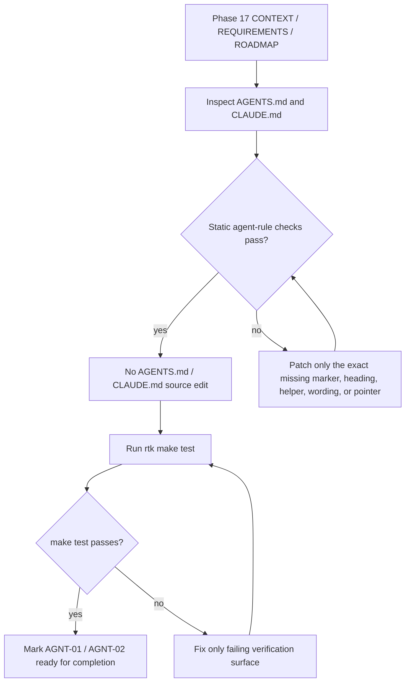

# Phase 17: Agent Rules Consolidation - Research

**Researched:** 2026-04-28 [VERIFIED: environment_context]
**Domain:** agent instruction consolidation, Markdown authority pointers, static verification [VERIFIED: .planning/phases/17-agent-rules-consolidation/17-CONTEXT.md]
**Confidence:** HIGH [VERIFIED: static agent-rule checks, `rtk make test`]

<user_constraints>
## User Constraints (from CONTEXT.md)

### Locked Decisions

## Implementation Decisions

### Phase Scope Handling
- **D-17-01:** Treat Phase 17 as minimal verification and necessary small fixes. Do not perform a broad rewrite of existing agent rules.
- **D-17-02:** If `AGENTS.md` and `CLAUDE.md` already satisfy the Phase 17 success criteria, implementation may be verification-only for those files.

### `AGENTS.md` Dev Orchestra Block
- **D-17-03:** Keep the existing `<!-- hermes-dev-orchestra-start -->` / `<!-- hermes-dev-orchestra-end -->` block concise.
- **D-17-04:** Patch only real gaps: stale paths, missing required sections, missing actual `orch-*` helpers, inaccurate authority wording, or managed-section damage.
- **D-17-05:** Do not expand `AGENTS.md` into a duplicate of `.planning/SPEC.md`. The Dev Orchestra block should remain a navigation and boundary summary.

### `CLAUDE.md` Handling
- **D-17-06:** Keep `CLAUDE.md` pointer-only for Dev Orchestra authority.
- **D-17-07:** `CLAUDE.md` should reference `AGENTS.md` for agent rules and `.planning/SPEC.md` for canonical specification authority.
- **D-17-08:** Do not copy the full Dev Orchestra rule set into `CLAUDE.md`; avoid future drift between agent instruction files.

### Merge Verification Standard
- **D-17-09:** Phase 17 verification must include static agent-rule checks plus `make test`.
- **D-17-10:** Static checks should cover managed marker preservation, Dev Orchestra delimiter presence, required headings, actual helper list coverage, L3/L4 no-auto-approval wording, and `CLAUDE.md` authority pointers.

### Claude's Discretion

- Exact grep/Python/Bash implementation for static checks.
- Exact wording of small fixes if a real gap is found.
- Whether no `AGENTS.md` / `CLAUDE.md` source edit is needed when verification already passes.

### Deferred Ideas (OUT OF SCOPE)

None - discussion stayed within Phase 17 scope.
</user_constraints>

<phase_requirements>
## Phase Requirements

| ID | Description | Research Support |
|----|-------------|------------------|
| AGNT-01 | `AGENTS.md` appends Dev Orchestra Package Boundary and Agent Role Boundary without overwriting existing managed sections. [VERIFIED: .planning/REQUIREMENTS.md] | Current `AGENTS.md` preserves GSD managed markers, contains the `hermes-dev-orchestra` delimited block, includes `### Package Boundary` and `### Agent Role Boundary`, and includes all current `orch-*` helpers. [VERIFIED: AGENTS.md, specs/commands.md, static agent-rule checks] |
| AGNT-02 | If `CLAUDE.md` exists, it points to `AGENTS.md` and `.planning/SPEC.md` as authorities without repeating all rules. [VERIFIED: .planning/REQUIREMENTS.md] | Current `CLAUDE.md` contains `## Hermes Dev Orchestra References` and points to `AGENTS.md` plus `.planning/SPEC.md`; the Phase 17 plan should verify pointer-only behavior rather than duplicate the rule set. [VERIFIED: CLAUDE.md, .planning/phases/17-agent-rules-consolidation/17-CONTEXT.md] |
</phase_requirements>

## Project Constraints (from CLAUDE.md)

- Shell commands should use `rtk`; `rtk --version` returned `rtk 0.37.2`. [VERIFIED: CLAUDE.md, /home/stark/.claude/RTK.md, `rtk --version`]
- User-facing responses must be Simplified Chinese. [VERIFIED: CLAUDE.md]
- Prefer retrieval-led reasoning over pre-training-led reasoning. [VERIFIED: CLAUDE.md]
- Agent Reach is available but should be fallback/enhancement only, and Agent Reach temporary/persistent files must stay outside the project workspace under `/tmp/` or `~/.agent-reach/`. [VERIFIED: CLAUDE.md]
- Implementation should be simple, surgical, and goal-driven; changed lines should trace directly to the user request. [VERIFIED: CLAUDE.md]
- `CLAUDE.md` already points Dev Orchestra readers to `AGENTS.md` for agent rules and `.planning/SPEC.md` for canonical specification authority. [VERIFIED: CLAUDE.md]

## Project Constraints (from AGENTS.md)

- The repository is a specification-package and adapter-layer project, not a standalone runtime implementation. [VERIFIED: AGENTS.md]
- Keep planning/specification changes focused on `.planning/` unless implementation work is explicitly in scope; Phase 17 explicitly reviews `AGENTS.md` and `CLAUDE.md`. [VERIFIED: AGENTS.md, .planning/phases/17-agent-rules-consolidation/17-CONTEXT.md]
- Do not modify `gbrain/` unless explicitly requested. [VERIFIED: AGENTS.md]
- Preserve the spec-first boundary: requirements, specs, roadmap, and state are authoritative planning artifacts. [VERIFIED: AGENTS.md]
- Hermes, Claude, Codex, and User authority boundaries must remain explicit, and L3/L4 decisions must never be auto-approved. [VERIFIED: AGENTS.md, .planning/SPEC.md]
- No project-local skills were found under `.claude/skills/` or `.agents/skills/`. [VERIFIED: `rtk find .claude .agents -maxdepth 3 -type f -name SKILL.md`]

## Summary

Phase 17 should be planned as a convergence and verification phase, not as a rewrite. Current repository evidence shows `AGENTS.md` already preserves GSD managed sections and already contains a concise Dev Orchestra block with Package Boundary, Agent Role Boundary, Directory Navigation, the current helper list, and L3/L4 no-auto-approval language. [VERIFIED: AGENTS.md, .planning/phases/13-evidence-audit-and-discoverability/13-01-SUMMARY.md, static agent-rule checks]

Current `CLAUDE.md` already contains a pointer-only Dev Orchestra reference section pointing to `AGENTS.md` and `.planning/SPEC.md`; this matches AGNT-02 and D-17-06 through D-17-08. [VERIFIED: CLAUDE.md, .planning/phases/17-agent-rules-consolidation/17-CONTEXT.md]

The research-time static checks passed, and `rtk make test` passed with 10 smoke/spec tests, 3 risk tests, JSON lint, explicit shellcheck skip, and upstream pin match. [VERIFIED: static agent-rule checks, `rtk make test`, Makefile]

**Primary recommendation:** Plan one verification-first task: run static agent-rule checks, patch only exact failures if any appear, then run `rtk make test`; do not schedule a broad `AGENTS.md` or `CLAUDE.md` rewrite. [VERIFIED: .planning/phases/17-agent-rules-consolidation/17-CONTEXT.md, static agent-rule checks]

## Architectural Responsibility Map

| Capability | Primary Tier | Secondary Tier | Rationale |
|------------|--------------|----------------|-----------|
| Agent rule discoverability | Root agent instruction docs | `.planning/SPEC.md` | `AGENTS.md` is the agent-rule surface and `.planning/SPEC.md` remains canonical for planning authority. [VERIFIED: AGENTS.md, .planning/SPEC.md] |
| Dev Orchestra package boundary | `AGENTS.md` Dev Orchestra block | `specs/commands.md` | `AGENTS.md` summarizes the adapter-layer boundary; `specs/commands.md` verifies the current `orch-*` command surface. [VERIFIED: AGENTS.md, specs/commands.md] |
| Agent role authority | `AGENTS.md` Dev Orchestra block | `.planning/SPEC.md` AUTH and AGENT sections | `AGENTS.md` gives operational guardrails; `.planning/SPEC.md` defines Hermes, Claude, Codex, and User authority contracts. [VERIFIED: AGENTS.md, .planning/SPEC.md] |
| Claude-facing authority pointer | `CLAUDE.md` | `AGENTS.md`, `.planning/SPEC.md` | `CLAUDE.md` should point to authorities instead of duplicating rule content. [VERIFIED: CLAUDE.md, .planning/phases/17-agent-rules-consolidation/17-CONTEXT.md] |
| Merge verification | Static shell/Python checks and root `Makefile` | Existing smoke/risk/spec scripts | Phase 17 requires static agent-rule checks plus `make test`; Phase 16 made `make test` the local aggregate gate. [VERIFIED: .planning/phases/17-agent-rules-consolidation/17-CONTEXT.md, Makefile, .planning/phases/16-makefile-dev-workflow/16-01-SUMMARY.md] |

## Standard Stack

### Core

| Library / Tool | Version | Purpose | Why Standard |
|----------------|---------|---------|--------------|
| Markdown files (`AGENTS.md`, `CLAUDE.md`) | N/A | Agent instruction and authority pointer surface. | Phase 17 deliverables are root Markdown instruction files, not runtime code. [VERIFIED: .planning/ROADMAP.md, AGENTS.md, CLAUDE.md] |
| GNU Make | 4.3 | Aggregate local verification via `make test`. | Phase 16 created the root Makefile as the local verification entrypoint. [VERIFIED: `rtk make --version`, Makefile, .planning/phases/16-makefile-dev-workflow/16-01-SUMMARY.md] |
| Bash | 5.2.21 | Run static checks and existing smoke/risk scripts. | Existing tests and Makefile targets are Bash-based. [VERIFIED: `rtk bash --version`, docs/orchestra/scripts/tests/run-all.sh, Makefile] |
| Python | 3.12.3 | JSON lint and optional static content validation. | Existing `lint-json` uses Python stdlib `json.tool`, and existing spec tests use Python for Markdown metadata validation. [VERIFIED: `rtk python3 --version`, Makefile, docs/orchestra/scripts/tests/test-specs.sh] |
| ripgrep (`rg`) | 15.1.0 | Fast repository text/file discovery during planning and verification. | Project and Codex instructions prefer `rg` for search; research used it to verify requirements and paths. [VERIFIED: `rtk rg --version`, AGENTS.md instructions] |

### Supporting

| Tool | Version / Status | Purpose | When to Use |
|------|------------------|---------|-------------|
| Git | 2.43.0 | Worktree review and upstream pin comparison through Makefile. | Use before/after Phase 17 to confirm only intended files changed. [VERIFIED: `rtk git --version`, Makefile] |
| shellcheck | Missing | Optional shell lint under `make lint-shell`. | No install is required for Phase 17 because Makefile explicitly skips shell lint when shellcheck is absent. [VERIFIED: `rtk shellcheck --version`, Makefile, `rtk make test`] |
| rtk | 0.37.2 | Token-optimized shell command proxy. | Use as the prefix for shell commands in this project environment. [VERIFIED: `rtk --version`, /home/stark/.claude/RTK.md] |

### Alternatives Considered

| Instead of | Could Use | Tradeoff |
|------------|-----------|----------|
| Inline static checks | Add `docs/orchestra/scripts/tests/test-agent-rules.sh` | Persistent regression coverage is stronger, but Phase 17 context allows verification-only if current files pass; adding a test file is optional planner discretion, not a required source edit. [VERIFIED: .planning/phases/17-agent-rules-consolidation/17-CONTEXT.md, docs/orchestra/scripts/tests listing] |
| Grep checks | Full Markdown AST parser | AST parsing is unnecessary for fixed markers, headings, and pointer strings; exact content checks match current Bash test style. [VERIFIED: docs/orchestra/scripts/tests/test-docs.sh, docs/orchestra/scripts/tests/test-specs.sh] |
| Duplicating rules in `CLAUDE.md` | Pointer-only `CLAUDE.md` | Duplicating would violate D-17-08 and increase drift risk. [VERIFIED: .planning/phases/17-agent-rules-consolidation/17-CONTEXT.md, CLAUDE.md] |

**Installation:**
```bash
# No package installation is required for Phase 17. [VERIFIED: Makefile, .planning/phases/17-agent-rules-consolidation/17-CONTEXT.md]
```

**Version verification:**
```bash
rtk make --version      # GNU Make 4.3 [VERIFIED: command output]
rtk bash --version      # GNU bash 5.2.21 [VERIFIED: command output]
rtk python3 --version   # Python 3.12.3 [VERIFIED: command output]
rtk rg --version        # ripgrep 15.1.0 [VERIFIED: command output]
rtk git --version       # git 2.43.0 [VERIFIED: command output]
rtk --version           # rtk 0.37.2 [VERIFIED: command output]
```

## Architecture Patterns

### System Architecture Diagram



This data flow matches the locked Phase 17 decision to verify first and patch only real gaps. [VERIFIED: .planning/phases/17-agent-rules-consolidation/17-CONTEXT.md, static agent-rule checks, `rtk make test`]

### Recommended Project Structure

```text
AGENTS.md                                      # Agent rule surface and Dev Orchestra block. [VERIFIED: AGENTS.md]
CLAUDE.md                                      # Claude-facing pointer file. [VERIFIED: CLAUDE.md]
Makefile                                       # Aggregate verification target. [VERIFIED: Makefile]
specs/commands.md                              # Current orch-* helper surface projection. [VERIFIED: specs/commands.md]
specs/risk-decisions.md                        # L3/L4 blocking and no-auto-approval projection. [VERIFIED: specs/risk-decisions.md]
.planning/phases/17-agent-rules-consolidation/ # Phase 17 planning artifacts. [VERIFIED: phase directory listing]
```

### Pattern 1: Preserve Managed Sections and Patch Only the Dev Orchestra Block

**What:** Verify GSD managed markers remain intact, then inspect only the `<!-- hermes-dev-orchestra-start -->` / `<!-- hermes-dev-orchestra-end -->` block for Phase 17 content. [VERIFIED: AGENTS.md, .planning/phases/17-agent-rules-consolidation/17-CONTEXT.md]

**When to use:** Use this for AGNT-01 planning and implementation. [VERIFIED: .planning/REQUIREMENTS.md]

**Example:**
```bash
# Source: .planning/phases/17-agent-rules-consolidation/17-CONTEXT.md and research-time static check. [VERIFIED]
rtk bash -lc 'set -euo pipefail
for marker in "<!-- GSD:project-start" "<!-- GSD:workflow-end -->" "<!-- hermes-dev-orchestra-start -->" "<!-- hermes-dev-orchestra-end -->"; do
  grep -q "$marker" AGENTS.md
done
grep -q "### Package Boundary" AGENTS.md
grep -q "### Agent Role Boundary" AGENTS.md'
```

### Pattern 2: Derive Helper Coverage from the Actual Helper Surface

**What:** Compare `AGENTS.md` helper mentions against `docs/orchestra/scripts/bin/orch-*` and `specs/commands.md` instead of relying on memory. [VERIFIED: docs/orchestra/scripts/bin listing, specs/commands.md, AGENTS.md]

**When to use:** Use this before declaring AGNT-01 complete. [VERIFIED: .planning/REQUIREMENTS.md]

**Example:**
```bash
# Source: research-time helper comparison. [VERIFIED]
rtk python3 -c 'from pathlib import Path
agents = Path("AGENTS.md").read_text()
cmds = [p.name for p in sorted(Path("docs/orchestra/scripts/bin").glob("orch-*"))]
missing = [cmd for cmd in cmds if cmd not in agents]
raise SystemExit(f"missing helpers: {missing}" if missing else 0)'
```

### Pattern 3: Keep CLAUDE.md Pointer-Only

**What:** Verify `CLAUDE.md` has a Dev Orchestra reference section and points to `AGENTS.md` plus `.planning/SPEC.md`. [VERIFIED: CLAUDE.md]

**When to use:** Use this for AGNT-02 and to prevent duplicated authority rules. [VERIFIED: .planning/REQUIREMENTS.md, .planning/phases/17-agent-rules-consolidation/17-CONTEXT.md]

**Example:**
```bash
# Source: .planning/phases/17-agent-rules-consolidation/17-CONTEXT.md and research-time static check. [VERIFIED]
rtk bash -lc 'set -euo pipefail
grep -q "Hermes Dev Orchestra References" CLAUDE.md
grep -q "AGENTS.md" CLAUDE.md
grep -q ".planning/SPEC.md" CLAUDE.md'
```

### Anti-Patterns to Avoid

- **Broad `AGENTS.md` rewrite:** It can damage managed sections and violates D-17-01 through D-17-05. [VERIFIED: .planning/phases/17-agent-rules-consolidation/17-CONTEXT.md]
- **Copying `.planning/SPEC.md` into `CLAUDE.md`:** It violates pointer-only handling and creates drift. [VERIFIED: .planning/phases/17-agent-rules-consolidation/17-CONTEXT.md]
- **Inventing new `orch-*` helpers:** Phase 17 is documentation/rule consolidation and must use the existing helper surface. [VERIFIED: .planning/ROADMAP.md, specs/commands.md]
- **Treating `orch-risk-check` as approval authority:** `orch-risk-check` is a classifier/helper, not a replacement for L3/L4 blocking and explicit user action. [VERIFIED: AGENTS.md, specs/risk-decisions.md]
- **Editing upstream Hermes Agent core or runtime rules JSON:** Phase 17 is not a runtime-core or risk-rule mutation phase. [VERIFIED: AGENTS.md, .planning/phases/17-agent-rules-consolidation/17-CONTEXT.md]

## Don't Hand-Roll

| Problem | Don't Build | Use Instead | Why |
|---------|-------------|-------------|-----|
| Marker and heading verification | A custom Markdown parser | `grep` / small Python exact checks | Current repository tests already use direct content assertions for docs/spec contracts. [VERIFIED: docs/orchestra/scripts/tests/test-docs.sh, docs/orchestra/scripts/tests/test-specs.sh] |
| Full verification workflow | New test framework | Existing root `Makefile` and Bash smoke/risk scripts | Phase 16 already created `make test` as the local gate. [VERIFIED: Makefile, .planning/phases/16-makefile-dev-workflow/16-01-SUMMARY.md] |
| Command surface inventory | Manual remembered list | `docs/orchestra/scripts/bin/orch-*` plus `specs/commands.md` | The actual helper surface is present in files and projected in `specs/commands.md`. [VERIFIED: docs/orchestra/scripts/bin listing, specs/commands.md] |
| Risk approval behavior | New approval path or prose-only rule | Existing `specs/risk-decisions.md`, `orch-decisions`, `orch-approve`, and `orch-reject` wording | L3/L4 explicit user approval and no auto-approval are already specified and tested. [VERIFIED: specs/risk-decisions.md, Makefile, `rtk make test`] |
| Claude authority file | Duplicated rule copy in `CLAUDE.md` | Pointer-only references to `AGENTS.md` and `.planning/SPEC.md` | Pointer-only behavior is a locked Phase 17 decision. [VERIFIED: .planning/phases/17-agent-rules-consolidation/17-CONTEXT.md, CLAUDE.md] |

**Key insight:** Phase 17's hard part is avoiding unnecessary change; current files already satisfy the core contract, so the plan should prove that fact and only patch if a static check fails. [VERIFIED: static agent-rule checks, `rtk make test`, .planning/phases/17-agent-rules-consolidation/17-CONTEXT.md]

## Common Pitfalls

### Pitfall 1: Planning a Rewrite Instead of a Convergence Check
**What goes wrong:** The plan schedules a broad `AGENTS.md` or `CLAUDE.md` rewrite even though current content passes the contract. [VERIFIED: .planning/phases/17-agent-rules-consolidation/17-CONTEXT.md, static agent-rule checks]
**Why it happens:** The roadmap phrase "append rules" can be read as new content work without considering Phase 13 already added the block. [VERIFIED: .planning/ROADMAP.md, .planning/phases/13-evidence-audit-and-discoverability/13-01-SUMMARY.md]
**How to avoid:** Start with static checks; make source edits only for failed checks. [VERIFIED: .planning/phases/17-agent-rules-consolidation/17-CONTEXT.md]
**Warning signs:** Plan tasks mention "rewrite", "restructure", or "copy full spec into AGENTS/CLAUDE". [VERIFIED: .planning/phases/17-agent-rules-consolidation/17-CONTEXT.md]

### Pitfall 2: False Failure on Heading Wording
**What goes wrong:** A checker demands the literal heading `Dev Orchestra Package Boundary` even though current `AGENTS.md` has `## Hermes Dev Orchestra` followed by `### Package Boundary`. [VERIFIED: .planning/ROADMAP.md, AGENTS.md]
**Why it happens:** The success criterion is conceptual, while the Phase 17 context names the required headings as `Package Boundary` and `Agent Role Boundary`. [VERIFIED: .planning/ROADMAP.md, .planning/phases/17-agent-rules-consolidation/17-CONTEXT.md]
**How to avoid:** Check the heading inside the Dev Orchestra block rather than requiring duplicated words in the subheading. [VERIFIED: AGENTS.md, .planning/phases/17-agent-rules-consolidation/17-CONTEXT.md]
**Warning signs:** A plan proposes renaming headings despite static coverage passing. [VERIFIED: static agent-rule checks]

### Pitfall 3: Helper List Drift
**What goes wrong:** `AGENTS.md` helper list omits a real helper or includes a non-existent helper. [VERIFIED: specs/commands.md, docs/orchestra/scripts/bin listing]
**Why it happens:** Command surfaces changed across Phases 13-16. [VERIFIED: .planning/phases/13-evidence-audit-and-discoverability/13-01-SUMMARY.md, .planning/phases/16-makefile-dev-workflow/16-01-SUMMARY.md]
**How to avoid:** Compare against `docs/orchestra/scripts/bin/orch-*` and `specs/commands.md` during verification. [VERIFIED: docs/orchestra/scripts/bin listing, specs/commands.md]
**Warning signs:** A hard-coded helper list differs from the sorted filesystem inventory. [VERIFIED: research-time helper comparison]

### Pitfall 4: Duplicating Rules into CLAUDE.md
**What goes wrong:** `CLAUDE.md` becomes a second source of truth and drifts from `AGENTS.md` or `.planning/SPEC.md`. [VERIFIED: .planning/phases/17-agent-rules-consolidation/17-CONTEXT.md]
**Why it happens:** The planner treats `CLAUDE.md` as a full rule file instead of an authority pointer. [VERIFIED: .planning/phases/17-agent-rules-consolidation/17-CONTEXT.md]
**How to avoid:** Verify only `Hermes Dev Orchestra References`, `AGENTS.md`, and `.planning/SPEC.md` pointers. [VERIFIED: CLAUDE.md, static agent-rule checks]
**Warning signs:** New `CLAUDE.md` content repeats Package Boundary, Agent Role Boundary, helper lists, or risk rules. [VERIFIED: .planning/phases/17-agent-rules-consolidation/17-CONTEXT.md]

### Pitfall 5: Treating shellcheck Absence as a Failure
**What goes wrong:** A plan blocks on installing shellcheck even though Makefile intentionally skips shell lint if shellcheck is absent. [VERIFIED: Makefile, `rtk shellcheck --version`, `rtk make test`]
**Why it happens:** The aggregate `make test` includes `lint-shell`, but `lint-shell` is optional by design. [VERIFIED: Makefile, .planning/phases/16-makefile-dev-workflow/16-01-SUMMARY.md]
**How to avoid:** Accept `shellcheck not found; skipping shell lint` as a pass condition for this local environment. [VERIFIED: Makefile, `rtk make test`]
**Warning signs:** Plan includes shellcheck installation as a prerequisite for Phase 17. [VERIFIED: Makefile]

## Code Examples

Verified patterns from repository sources:

### Static Agent Rule Gate

```bash
# Source: Phase 17 CONTEXT suggested checks; verified in this research session. [VERIFIED]
rtk bash -lc 'set -euo pipefail
for marker in "<!-- GSD:project-start" "<!-- GSD:workflow-end -->" "<!-- hermes-dev-orchestra-start -->" "<!-- hermes-dev-orchestra-end -->"; do
  grep -q "$marker" AGENTS.md
done
grep -q "### Package Boundary" AGENTS.md
grep -q "### Agent Role Boundary" AGENTS.md
for cmd in orch-init orch-start orch-stop orch-status orch-bus-loop orch-risk-check orch-audit orch-decisions orch-approve orch-reject orch-verify; do
  grep -q "$cmd" AGENTS.md
done
grep -q "must not auto-approve L3/L4" AGENTS.md
grep -q "Hermes Dev Orchestra References" CLAUDE.md
grep -q "AGENTS.md" CLAUDE.md
grep -q ".planning/SPEC.md" CLAUDE.md'
```

### Helper Surface Comparison

```bash
# Source: docs/orchestra/scripts/bin and AGENTS.md; verified in this research session. [VERIFIED]
rtk python3 -c 'from pathlib import Path
agents = Path("AGENTS.md").read_text()
cmds = [p.name for p in sorted(Path("docs/orchestra/scripts/bin").glob("orch-*"))]
missing = [cmd for cmd in cmds if cmd not in agents]
if missing:
    raise SystemExit(f"missing helpers in AGENTS.md: {missing}")'
```

### Full Phase Gate

```bash
# Source: Phase 16 Makefile; passed in this research session. [VERIFIED]
rtk make test
```

## State of the Art

| Old Approach | Current Approach | When Changed | Impact |
|--------------|------------------|--------------|--------|
| Dev Orchestra agent rules absent or scattered | Delimited `## Hermes Dev Orchestra` block in `AGENTS.md` plus pointer-only `CLAUDE.md` | Phase 13 | Phase 17 should verify existing content before editing. [VERIFIED: .planning/phases/13-evidence-audit-and-discoverability/13-01-SUMMARY.md, AGENTS.md, CLAUDE.md] |
| Old package path `docs/hermes-dev-orchestra/` | Active package path `docs/orchestra/` | Phase 14 | Phase 17 should treat old-path references in current root instruction files as gaps; current `AGENTS.md` / `CLAUDE.md` do not contain the old package path. [VERIFIED: .planning/phases/14-migration-submodule-adr/14-CONTEXT.md, `rtk rg -n "docs/hermes-dev-orchestra\|hermes-dev-orchestra" AGENTS.md CLAUDE.md`] |
| Prose-only projections | `.planning/SPEC.md` canonical with narrow derived specs under `specs/` | Phase 15 | Helper and risk facts should be checked against `specs/commands.md` and `specs/risk-decisions.md`. [VERIFIED: .planning/phases/15-specification-system/15-CONTEXT.md, specs/commands.md, specs/risk-decisions.md] |
| Ad hoc local verification | Root `Makefile` with `make test` aggregate gate | Phase 16 | Phase 17 should use `rtk make test` as the full suite gate. [VERIFIED: Makefile, .planning/phases/16-makefile-dev-workflow/16-01-SUMMARY.md] |

**Deprecated/outdated:**
- Broad rewrite of agent files: Deprecated for Phase 17 by D-17-01 through D-17-05. [VERIFIED: .planning/phases/17-agent-rules-consolidation/17-CONTEXT.md]
- Full rule duplication in `CLAUDE.md`: Deprecated for Phase 17 by D-17-06 through D-17-08. [VERIFIED: .planning/phases/17-agent-rules-consolidation/17-CONTEXT.md]
- Treating `docs/hermes-dev-orchestra/` as an active package path: Deprecated by Phase 14 migration decisions. [VERIFIED: .planning/phases/14-migration-submodule-adr/14-CONTEXT.md]

## Assumptions Log

| # | Claim | Section | Risk if Wrong |
|---|-------|---------|---------------|
| — | No claims in this research are tagged as assumed. | All sections | No user confirmation required before planning. [VERIFIED: source provenance review of this document] |

## Open Questions

1. **None blocking.** Current `AGENTS.md`, `CLAUDE.md`, static checks, and `rtk make test` already support a verification-first Phase 17 plan. [VERIFIED: static agent-rule checks, `rtk make test`]

## Environment Availability

| Dependency | Required By | Available | Version | Fallback |
|------------|-------------|-----------|---------|----------|
| `rtk` | Project command execution convention | yes | 0.37.2 | None needed. [VERIFIED: `rtk --version`] |
| `make` | Full phase gate | yes | GNU Make 4.3 | Run underlying Bash scripts manually only if Makefile is unavailable. [VERIFIED: `rtk make --version`, Makefile] |
| `bash` | Static checks and smoke tests | yes | 5.2.21 | None needed. [VERIFIED: `rtk bash --version`] |
| `python3` | JSON lint and helper comparison | yes | 3.12.3 | Use grep-only checks for simpler validations. [VERIFIED: `rtk python3 --version`, Makefile] |
| `rg` | Repository discovery | yes | 15.1.0 | `grep` / `find`. [VERIFIED: `rtk rg --version`] |
| `git` | Worktree review and upstream status | yes | 2.43.0 | None needed for worktree review. [VERIFIED: `rtk git --version`] |
| `shellcheck` | Optional shell lint | no | — | Makefile skips shell lint when missing. [VERIFIED: `rtk shellcheck --version`, Makefile, `rtk make test`] |
| `gsd-sdk query` | GSD init/commit helper in generic workflow docs | no | installed `gsd-sdk` does not expose `query` | Direct `.planning/` file reads and normal git review are sufficient for this research step. [VERIFIED: `rtk gsd-sdk query init.phase-op 17`, `.planning/` file reads] |

**Missing dependencies with no fallback:**
- None for Phase 17 planning or verification. [VERIFIED: Environment Availability table]

**Missing dependencies with fallback:**
- `shellcheck` is missing; Makefile explicitly skips shell lint and `rtk make test` still passes. [VERIFIED: Makefile, `rtk make test`]
- `gsd-sdk query` is unavailable in this environment; direct `.planning/` reads provided the same phase context for research. [VERIFIED: `rtk gsd-sdk query init.phase-op 17`, `.planning/` file reads]

## Validation Architecture

### Test Framework

| Property | Value |
|----------|-------|
| Framework | Bash static checks plus root Makefile aggregate. [VERIFIED: Makefile, docs/orchestra/scripts/tests/*.sh] |
| Config file | `Makefile`; no separate test framework config. [VERIFIED: Makefile] |
| Quick run command | `rtk bash -lc '<static agent-rule checks>'` [VERIFIED: static agent-rule checks] |
| Full suite command | `rtk make test` [VERIFIED: Makefile, `rtk make test`] |

### Phase Requirements -> Test Map

| Req ID | Behavior | Test Type | Automated Command | File Exists? |
|--------|----------|-----------|-------------------|--------------|
| AGNT-01 | Preserve existing `AGENTS.md` managed sections and verify Dev Orchestra Package Boundary, Agent Role Boundary, helper list, and L3/L4 no-auto-approval wording. [VERIFIED: .planning/REQUIREMENTS.md, AGENTS.md] | static | `rtk bash -lc '<AGENTS.md marker/heading/helper/L3-L4 checks>'` | Inline command exists; no dedicated persistent `test-agent-rules.sh` file. [VERIFIED: docs/orchestra/scripts/tests listing] |
| AGNT-02 | Verify `CLAUDE.md` points to `AGENTS.md` and `.planning/SPEC.md` without becoming a duplicate rule source. [VERIFIED: .planning/REQUIREMENTS.md, CLAUDE.md] | static | `rtk bash -lc 'grep -q "Hermes Dev Orchestra References" CLAUDE.md && grep -q "AGENTS.md" CLAUDE.md && grep -q ".planning/SPEC.md" CLAUDE.md'` | Inline command exists; no dedicated persistent `test-agent-rules.sh` file. [VERIFIED: docs/orchestra/scripts/tests listing] |
| AGNT-01 / AGNT-02 | Confirm existing smoke/spec/risk/tooling gates still pass after any exact patch. [VERIFIED: .planning/phases/17-agent-rules-consolidation/17-CONTEXT.md, Makefile] | full suite | `rtk make test` | `Makefile` exists. [VERIFIED: Makefile] |

### Sampling Rate

- **Per task commit:** Run the static agent-rule checks. [VERIFIED: .planning/phases/17-agent-rules-consolidation/17-CONTEXT.md]
- **Per wave merge:** Run `rtk make test`. [VERIFIED: .planning/phases/17-agent-rules-consolidation/17-CONTEXT.md, Makefile]
- **Phase gate:** Static checks and `rtk make test` must both pass before `/gsd-verify-work`. [VERIFIED: .planning/phases/17-agent-rules-consolidation/17-CONTEXT.md, Makefile]

### Wave 0 Gaps

- No mandatory Wave 0 source gap was found in `AGENTS.md` or `CLAUDE.md`. [VERIFIED: static agent-rule checks]
- No dedicated persistent agent-rule test file exists; planner may keep the static check inline or add a small `docs/orchestra/scripts/tests/test-agent-rules.sh` only if persistent regression coverage is desired. [VERIFIED: docs/orchestra/scripts/tests listing, .planning/phases/17-agent-rules-consolidation/17-CONTEXT.md]
- Existing `Makefile` and Bash test infrastructure cover the full-suite gate. [VERIFIED: Makefile, `rtk make test`]

## Security Domain

### Applicable ASVS Categories

OWASP ASVS lists sections including V2 Authentication, V3 Session Management, V4 Access Control, V5 Validation/Sanitization/Encoding, V6 Stored Cryptography, and V14 Configuration. [CITED: https://devguide.owasp.org/en/06-verification/01-guides/03-asvs/]

| ASVS Category | Applies | Standard Control |
|---------------|---------|------------------|
| V2 Authentication | No runtime auth change in Phase 17. [VERIFIED: .planning/ROADMAP.md] | No new auth control; preserve existing authority pointers only. [VERIFIED: .planning/phases/17-agent-rules-consolidation/17-CONTEXT.md] |
| V3 Session Management | No runtime session change in Phase 17. [VERIFIED: .planning/ROADMAP.md] | No session control change. [VERIFIED: .planning/ROADMAP.md] |
| V4 Access Control | Yes, as agent authority/access boundary documentation. [VERIFIED: AGENTS.md, .planning/SPEC.md] | Preserve Hermes/Claude/Codex/User authority boundaries and L3/L4 explicit user approval. [VERIFIED: AGENTS.md, .planning/SPEC.md, specs/risk-decisions.md] |
| V5 Validation, Sanitization and Encoding | Limited to static repository-content validation, not runtime input handling. [VERIFIED: .planning/ROADMAP.md, static agent-rule checks] | Use exact static checks for markers, headings, helper list, and authority pointers. [VERIFIED: .planning/phases/17-agent-rules-consolidation/17-CONTEXT.md] |
| V6 Stored Cryptography | No cryptography change in Phase 17. [VERIFIED: .planning/ROADMAP.md] | No cryptographic control change. [VERIFIED: .planning/ROADMAP.md] |
| V14 Configuration | Yes, because agent instructions constrain risk-rule and package-boundary changes. [CITED: https://devguide.owasp.org/en/06-verification/01-guides/03-asvs/] [VERIFIED: AGENTS.md] | Do not mutate runtime `~/.hermes-orchestra/rules.json`; preserve `orch-risk-check` as classifier/helper, not approval authority. [VERIFIED: AGENTS.md, specs/risk-decisions.md] |

### Known Threat Patterns for This Phase

| Pattern | STRIDE | Standard Mitigation |
|---------|--------|---------------------|
| Agent authority drift through duplicated `CLAUDE.md` rules | Tampering | Keep `CLAUDE.md` pointer-only and verify `AGENTS.md` / `.planning/SPEC.md` references. [VERIFIED: .planning/phases/17-agent-rules-consolidation/17-CONTEXT.md, CLAUDE.md] |
| L3/L4 no-auto-approval wording regression | Elevation of Privilege | Static check `AGENTS.md` for no-auto-approval wording and run existing risk tests through `rtk make test`. [VERIFIED: AGENTS.md, specs/risk-decisions.md, `rtk make test`] |
| Command surface drift in agent instructions | Tampering | Compare `AGENTS.md` helper list against `docs/orchestra/scripts/bin/orch-*` and `specs/commands.md`. [VERIFIED: docs/orchestra/scripts/bin listing, specs/commands.md, research-time helper comparison] |
| Managed-section damage | Tampering | Static check GSD managed markers before and after any patch. [VERIFIED: AGENTS.md, static agent-rule checks] |

## Sources

### Primary (HIGH confidence)

- `.planning/phases/17-agent-rules-consolidation/17-CONTEXT.md` - locked decisions, verification standard, phase boundary. [VERIFIED]
- `.planning/REQUIREMENTS.md` - AGNT-01 and AGNT-02. [VERIFIED]
- `.planning/ROADMAP.md` - Phase 17 goal, dependency, success criteria. [VERIFIED]
- `.planning/STATE.md` - Phase 16 complete and Phase 17 ready to plan. [VERIFIED]
- `.planning/SPEC.md` - canonical authority boundaries, agent behavior, L3/L4 blocking. [VERIFIED]
- `AGENTS.md` - existing managed sections and Dev Orchestra block. [VERIFIED]
- `CLAUDE.md` - pointer-only Dev Orchestra references and project directives. [VERIFIED]
- `Makefile` - `make test` aggregate gate. [VERIFIED]
- `specs/commands.md` - current `orch-*` helper surface. [VERIFIED]
- `specs/risk-decisions.md` - L3/L4 blocking and no-auto-approval projection. [VERIFIED]
- `.planning/phases/13-evidence-audit-and-discoverability/13-01-SUMMARY.md` - prior verification that AGENTS/CLAUDE content existed. [VERIFIED]
- `.planning/phases/14-migration-submodule-adr/14-CONTEXT.md` - active package path migrated to `docs/orchestra/`. [VERIFIED]
- `.planning/phases/15-specification-system/15-CONTEXT.md` - `.planning/SPEC.md` canonical and `specs/` projections. [VERIFIED]
- `.planning/phases/16-makefile-dev-workflow/16-01-SUMMARY.md` - `make test` is available and intended for Phase 17. [VERIFIED]
- Research-time commands: static agent-rule checks, helper comparison, environment probes, and `rtk make test`. [VERIFIED]

### Secondary (MEDIUM confidence)

- OWASP Developer Guide ASVS page - ASVS category names and usage guidance for security-domain mapping. [CITED: https://devguide.owasp.org/en/06-verification/01-guides/03-asvs/]

### Tertiary (LOW confidence)

- None. [VERIFIED: source review]

## Metadata

**Confidence breakdown:**
- Standard stack: HIGH - all tools and files were verified locally. [VERIFIED: Environment Availability]
- Architecture: HIGH - phase scope, authority boundaries, and current file state are verified from planning artifacts and root instruction files. [VERIFIED: .planning/phases/17-agent-rules-consolidation/17-CONTEXT.md, AGENTS.md, CLAUDE.md, .planning/SPEC.md]
- Pitfalls: HIGH - pitfalls are derived from locked Phase 17 decisions, prior phase summaries, and research-time passing checks. [VERIFIED: .planning/phases/17-agent-rules-consolidation/17-CONTEXT.md, .planning/phases/13-evidence-audit-and-discoverability/13-01-SUMMARY.md, static agent-rule checks]
- Validation: HIGH - static checks and `rtk make test` passed in this session. [VERIFIED: static agent-rule checks, `rtk make test`]

**Graph context:** No `.planning/graphs/graph.json` file was present, and `graphify status` reported graphify disabled. [VERIFIED: `rtk ls .planning/graphs/graph.json`, `rtk node /home/stark/.codex/get-shit-done/bin/gsd-tools.cjs graphify status`]

**Research date:** 2026-04-28 [VERIFIED: environment_context]
**Valid until:** 2026-05-28 for this repository state, or earlier if `AGENTS.md`, `CLAUDE.md`, `specs/commands.md`, `specs/risk-decisions.md`, or `Makefile` changes. [VERIFIED: internal repository scope]
