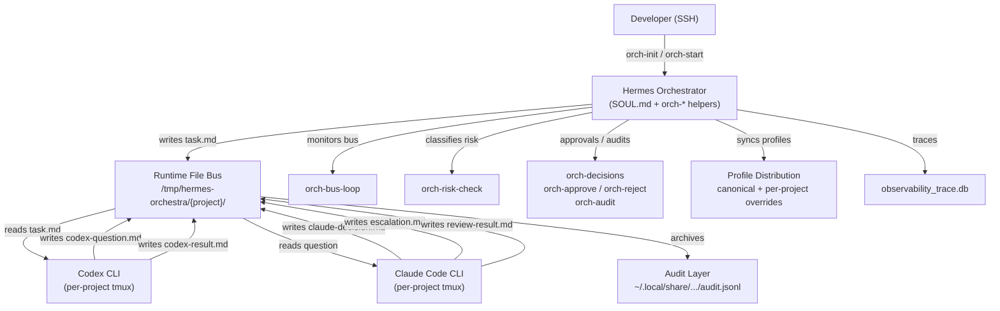

<!-- generated-by: gsd-doc-writer -->

# Hermes Dev Orchestra — Architecture

## System Overview

Hermes Dev Orchestra is a single-developer, multi-project AI development orchestration layer. It coordinates two external CLI agents — Claude Code CLI (supervisor/reviewer) and Codex CLI (implementer) — across concurrent projects by mediating their communication through a file-based JSON envelope bus, tmux session isolation, and a static risk rulebook with L1–L4 escalation. The system does not perform code generation itself; it routes tasks, decisions, questions, and results between agents while enforcing guardrails and audit logging.

<!-- VERIFY: Requires Hermes Agent v0.11.0+, Claude Code CLI v2.1.110+, and Codex CLI v0.122.0+ installed on the host. -->

---

## Component Diagram



---

## Data Flow

A typical task flows through the system as follows:

1. **Task Ingestion** — The developer (or Hermes itself) describes work. Hermes writes a JSON envelope to `/tmp/hermes-orchestra/{project}/task.md` with `schema_version`, `project_id`, `task_id`, `correlation_id`, and `task_body`.

2. **Dispatch** — `orch-bus-loop` (or an equivalent watcher) detects the new `task.md` and forwards it into the Codex tmux session, injecting the current project workspace and role context.

3. **Execution** — Codex reads the task, begins implementation, and may pause to ask a technical question. It writes `codex-question.md` and stops.

4. **Supervision** — The watcher routes `codex-question.md` to the Claude tmux session. Claude writes a `claude-decision.md` envelope with its answer.

5. **Resume** — The watcher injects the decision back into Codex. Codex resumes and, on completion, writes `codex-result.md`.

6. **Review** — The watcher forwards `codex-result.md` to Claude, which produces `review-result.md`.

7. **Escalation (conditional)** — If Claude detects a dangerous operation (e.g., schema change, destructive deletion), it writes `escalation.md`. `orch-risk-check` classifies the payload against `config/risk-policy.yaml`. L3/L4 blocks the project until the user approves via `orch-approve` or rejects via `orch-reject`.

8. **Audit** — Completed messages are atomically migrated from Runtime to the Audit layer (`~/.local/share/hermes-orchestra/{project}/audit.jsonl`). Runtime files are not durable evidence.

---

## Key Abstractions

| Abstraction | Location | Purpose |
|-------------|----------|---------|
| **File Bus Envelope** | `specs/file-bus.md` | Canonical JSON envelope contract for all inter-agent messages: `schema_version`, `message_id`, `project_id`, `task_id`, `correlation_id`, `status`, `author`, `authority`, `timestamp`. |
| **Risk Policy** | `config/risk-policy.yaml` | Static L2–L4 rulebook floors. Defines regex/keyword matches for destructive operations (e.g., `DROP DATABASE`, `sudo`, `docker system prune`) and per-role guardrails (denied tools, read-only restrictions). |
| **Role Engine Protocol v1** | `hermes/role-engine-protocol/v1/` | Contract between Hermes workflow profiles and external CLI engines. Specifies common request/response fields and a shared `next_action` enum (`continue`, `wait_for_user`, `block`, `complete`, `defer_to_human`, `create_tasks`, `create_research_task`). |
| **Profile Distribution** | `hermes/profile-distribution/` | Canonical base profiles (`pm`, `implementer`, `reviewer`, `orchestrator`, `qa-tester`, `devops-engineer`, `sre-observer`, `researcher`) plus project-local overrides. Each profile contains a `SOUL.md` and a `config.yaml`. |
| **Decision Lifecycle** | `scripts/bin/orch-decisions`, `orch-approve`, `orch-reject` | File-based approval protocol: `{decision-id}.request.json` → `{decision-id}.response.json`. One-time `approval_id` binding with TTL and project/task scoping; replays are rejected. |
| **Project Isolation** | `scripts/bin/orch-init`, `orch-start` | Per-project tmux sessions (`hermes-{project}-claude`, `hermes-{project}-codex`) and segregated `Runtime` / `State` / `Audit` / `Cache` directories. |
| **Bus Loop Watcher** | `scripts/bin/orch-bus-loop` | Bash-driven polling loop that scans Runtime bus files, validates ownership/correlation, dispatches messages into tmux sessions, and migrates completed records to Audit. |
| **Skills** | `skills/{dev-orchestra,claude-supervisor,codex-executor,escalation-handler}/SKILL.md` | Hermes-native skill definitions that encode the orchestration workflow, role behaviors, and escalation handling logic consumed by the upstream Hermes Agent. |
| **Pre-Tool Risk Gate** | `hermes/hooks/pre_tool_call-risk-gate.sh` | Hook script invoked before tool execution to enforce role-specific guardrails and risk floors at the CLI layer. |

---

## Directory Structure Rationale

```
hermes/
  hooks/                  — Runtime hook scripts (e.g., pre-tool risk gate).
  plugins/                — Observability and tracing plugins (Python sidecar).
  profile-distribution/   — Canonical role profiles and distribution manifest.
  role-engine-protocol/   — Versioned contract specs and JSON examples for CLI engines.
  SOUL.md                 — Orchestrator persona definition.

scripts/
  bin/                    — User-facing `orch-*` helper commands.
  lib/                    — Shared Bash utilities (`orch-common.sh`).
  tests/                  — Bash smoke tests for contracts, bus routing, risk, and decisions.

skills/
  dev-orchestra/          — Main orchestration skill.
  claude-supervisor/      — Claude supervisor role skill.
  codex-executor/         — Codex executor role skill.
  escalation-handler/     — Escalation and risk-handling skill.

config/
  risk-policy.yaml        — Canonical risk rulebook and role guardrails.
  rules.json              — Static rule floor data for `orch-risk-check`.

specs/
  commands.md             — Derived spec for `orch-*` CLI surface.
  file-bus.md             — Derived spec for Runtime bus protocol.
  risk-decisions.md       — Derived spec for approval lifecycle and L3/L4 blocking.

claude-config/
  settings.json           — Per-project Claude Code settings with Hook configurations.

docs/
  COVERAGE-MATRIX.md      — Capability coverage matrix (upstream vs adapter vs deferred).
  ARCHITECTURE.md         — This document.

reference/
  hermes-docs-index/      — Indexed upstream documentation for retrieval-led reasoning.
```
