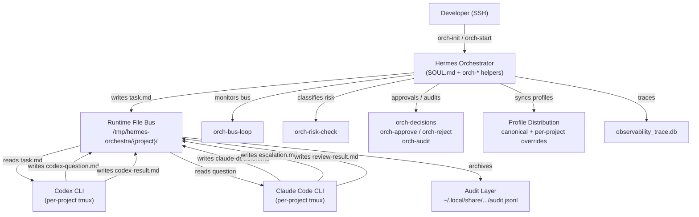

<!-- generated-by: gsd-doc-writer -->

# Hermes Dev Orchestra — Architecture

## System Overview

Hermes Dev Orchestra is a single-developer, multi-project AI development orchestration layer. Its original active path coordinates two external CLI agents — Claude Code CLI (supervisor/reviewer) and Codex CLI (implementer) — through a file-based JSON envelope bus, tmux session isolation, and a static risk rulebook with L1–L4 escalation. The current system also includes a Python local HTTP Gateway for run projection, actor-token authority checks, staged debate/worker modules, success metrics, and strict 0→6 validation gates. Full-target runtime cutover is mixed-family and staged, not a one-shot global switch.

<!-- VERIFY: Minimums are Hermes Agent v0.11.0+, Claude Code CLI v2.1.110+, and Codex CLI v0.122.0+. Last local verification used Hermes Agent v0.13.0, Claude Code 2.1.161, and codex-cli 0.136.0. -->

## Current Remediation in Flight

The 13-sprint PRD Compliance Audit Remediation plan is in active execution. See [`docs/sprints/prd-compliance-audit-remediation-full/sprint-overview.md`](sprints/prd-compliance-audit-remediation-full/sprint-overview.md) for the authoritative plan. This section surfaces the 6 cross-sprint contracts, Sprint 12 deliverable owner, and Sprint 13 audit gate consumer; for full field shapes, see [`docs/gateway-integration-architecture.md`](gateway-integration-architecture.md) `## Cross-Sprint Contract Surfaces`.

| Aspect | Status | Reference |
|---|---|---|
| Source of truth | `sprint-overview.md` Sprint Table + `schema.md` | `docs/sprints/prd-compliance-audit-remediation-full/` |
| Cross-sprint contracts surfaced | 6 (see `gateway-integration-architecture.md` `## Cross-Sprint Contract Surfaces`) | Contracts 1-6 in gateway doc |
| Strict 0→6 gate scripts | `test-e2e-strict-six-stage-flow.sh`, `test-success-metrics-pipeline.sh`, `test-schema-doc-sync.sh` | `## Key Abstractions` row "Strict Gate Harness" below |
| Sprint 12 deliverable | `plan-sprint-12.md` U14 (schema/doc/metrics sync) — owner: solo, 3 SP | `scripts/tests/test-prd-remediation-schema-doc-sync.sh` |
| Sprint 13 audit gate consumer | consumes Sprint 12 evidence refs; final PRD compliance gate | `plan-sprint-13.md` |
| Prior gate slice (archived) | `docs/archive/sprints/prd-compliance-audit-remediation/` (Sprint 1 only) | `plan-sprint-1.md` L13 |

### Known Limitations of the in-flight plan

The audit-remediation-full plan declares three explicit boundaries (`sprint-overview.md` L38-42):

- **Prior Conflict Ledger gate slice**: archived at `docs/archive/sprints/prd-compliance-audit-remediation/`. The current plan does not overwrite it; Sprint 1's `conflict_ledger` schema and closeout integration consume it.
- **DAG scope**: DAG work is scoped to **Gateway integration seam only** (consuming `scripts/lib/dag_validator.py` results as blocking advancement evidence). Low-level cycle detection already exists in `dag_validator.py` and is **not** in scope.
- **Rollback scope**: rollback implementation is limited to `current-run refs[]` (per `rollback_report.affected_refs[]` in `schema.md` L42-44). Must not touch unrelated branches or protected targets; `protected_target_check` is a required field in `rollback_report`.

## Current Architecture Layers

| Layer | Runtime status | Notes |
|---|---|---|
| MVP/local orchestration | active/current | tmux Claude/Codex sessions, file bus, local decision CLI, Audit JSONL |
| Gateway runtime | partially implemented/current | `orch-gateway`, Run Projection API, actor-token authority, worker/debate/evaluation/closeout paths |
| Strict 0→6 gates | ready/test harness | schema/doc sync, success metrics, strict six-stage staging regression |
| Full-target system | staged/mixed-family | see `docs/FULL-COVERAGE-MATRIX.md`; release/remote decision/deeper full artifact cutover remain incomplete |

---

## MVP Component Diagram


```mermaid
graph TD
    User["Developer (SSH)"] -->|orch-init / orch-start| Hermes["Hermes Orchestrator<br/>(SOUL.md + orch-* helpers)"]
    Hermes -->|writes task.md| Bus["Runtime File Bus<br/>/tmp/hermes-orchestra/{project}/"]
    Bus -->|reads task.md| Codex["Codex CLI<br/>(per-project tmux)"]
    Codex -->|writes codex-question.md| Bus
    Codex -->|writes codex-result.md| Bus
    Bus -->|reads question| Claude["Claude Code CLI<br/>(per-project tmux)"]
    Claude -->|writes claude-decision.md| Bus
    Claude -->|writes escalation.md| Bus
    Claude -->|writes review-result.md| Bus
    Hermes -->|monitors bus| BusLoop["orch-bus-loop"]
    Hermes -->|classifies risk| RiskCheck["orch-risk-check"]
    Hermes -->|approvals / audits| DecisionCLI["orch-decisions<br/>orch-approve / orch-reject<br/>orch-audit"]
    Bus -->|archives| Audit["Audit Layer<br/>~/.local/share/.../audit.jsonl"]
    Hermes -->|syncs profiles| Profiles["Profile Distribution<br/>canonical + per-project overrides"]
    Hermes -->|traces| Obs["observability_trace.db"]
```

---

## MVP Data Flow

A typical MVP/local task flows through the system as follows:

1. **Task Ingestion** — The developer (or Hermes itself) describes work. Hermes writes a JSON envelope to `/tmp/hermes-orchestra/{project}/task.md` with `schema_version`, `project_id`, `task_id`, `correlation_id`, and `task_body`.

2. **Dispatch** — `orch-bus-loop` (or an equivalent watcher) detects the new `task.md` and forwards it into the Codex tmux session, injecting the current project workspace and role context.

3. **Execution** — Codex reads the task, begins implementation, and may pause to ask a technical question. It writes `codex-question.md` and stops.

4. **Supervision** — The watcher routes `codex-question.md` to the Claude tmux session. Claude writes a `claude-decision.md` envelope with its answer.

5. **Resume** — The watcher injects the decision back into Codex. Codex resumes and, on completion, writes `codex-result.md`.

6. **Review** — The watcher forwards `codex-result.md` to Claude, which produces `review-result.md`.

7. **Escalation (conditional)** — If Claude detects a dangerous operation (e.g., schema change, destructive deletion), it writes `escalation.md`. `orch-risk-check` classifies the payload against `config/risk-policy.yaml`. L3/L4 blocks the project until the user approves via `orch-approve` or rejects via `orch-reject`.

8. **Audit** — Completed messages are atomically migrated from Runtime to the Audit layer (`~/.local/share/hermes-orchestra/{project}/audit.jsonl`). Runtime files are not durable evidence.

---

## Key Abstractions

| Abstraction | Location | Purpose |
|-------------|----------|---------|
| **File Bus Envelope** | `specs/file-bus.md` | Canonical JSON envelope contract for all inter-agent messages: `schema_version`, `message_id`, `project_id`, `task_id`, `correlation_id`, `status`, `author`, `authority`, `timestamp`. |
| **Risk Policy** | `config/risk-policy.yaml` | Static L2–L4 rulebook floors. Defines regex/keyword matches for destructive operations (e.g., `DROP DATABASE`, `sudo`, `docker system prune`) and per-role guardrails (denied tools, read-only restrictions). |
| **Role Engine Protocol v1** | `hermes/role-engine-protocol/v1/` | Contract between Hermes workflow profiles and external CLI engines. Specifies common request/response fields and a shared `next_action` enum (`continue`, `wait_for_user`, `block`, `complete`, `defer_to_human`, `create_tasks`, `create_research_task`). |
| **Profile Distribution** | `hermes/profile-distribution/` | Canonical base profiles (`pm`, `implementer`, `reviewer`, `orchestrator`, `qa-tester`, `devops-engineer`, `sre-observer`, `researcher`) plus project-local overrides. Each profile contains a `SOUL.md` and a `config.yaml`. |
| **Decision Lifecycle** | `scripts/bin/orch-decisions`, `orch-approve`, `orch-reject` | File-based approval protocol: `{decision-id}.request.json` → `{decision-id}.response.json`. One-time `approval_id` binding with TTL and project/task scoping; replays are rejected. |
| **Project Isolation** | `scripts/bin/orch-init`, `orch-start` | Per-project tmux sessions (`hermes-{project}-claude`, `hermes-{project}-codex`) and segregated `Runtime` / `State` / `Audit` / `Cache` directories. |
| **Bus Loop Watcher** | `scripts/bin/orch-bus-loop` | Bash-driven polling loop that scans Runtime bus files, validates ownership/correlation, dispatches messages into tmux sessions, and migrates completed records to Audit. |
| **Skills** | `skills/{dev-orchestra,claude-supervisor,codex-executor,escalation-handler}/SKILL.md` | Hermes-native skill definitions that encode the orchestration workflow, role behaviors, and escalation handling logic consumed by the upstream Hermes Agent. |
| **Pre-Tool Risk Gate** | `hermes/hooks/pre_tool_call-risk-gate.sh` | Hook script invoked before tool execution to enforce role-specific guardrails and risk floors at the CLI layer. |
| **Gateway Runtime** | `scripts/lib/orch_gateway.py`, `scripts/bin/orch-gateway` | Local HTTP runtime for Run Projection API, Gateway State/Audit, authority checks, idempotency, worker/debate/evaluation/closeout endpoints. |
| **Run Projection Response Header** | `X-Projection-Schema-Version: 1.0.0` | Returned by `GET /orchestra/runs/{run_id}/projection` to version Kimi-facing projection payloads. |
| **Actor Token Expiry** | 300 seconds + 30 seconds clock skew | HMAC-validated actor tokens (L3/L4 approval claims supported). |
| **Cutover Config** | `config/cutover/full-readiness-gates.json`, `config/cutover/runtime-family-activation.json` | Source of truth for staged-vs-active policy; family-scoped activation override. |
| **Authority Matrix** | `config/decisions/authority-matrix.json`, `docs/FULL-CAPABILITY-AUTHORITY-MATRIX.md` | Runtime and full-target actor capability boundaries. |
| **Strict Gate Harness** | `scripts/tests/test-e2e-strict-six-stage-flow.sh`, `scripts/tests/test-success-metrics-pipeline.sh`, `scripts/tests/test-schema-doc-sync.sh` | Regression gates for strict 0→6 flow, success metrics, and schema/doc/Gateway sync. **Owner**: Sprint 12 (`plan-sprint-12.md` U14, 3 SP). **Consumer**: Sprint 13 (`plan-sprint-13.md` final audit gate). Required evidence refs per `plan-sprint-12.md` Test Matrix: schema validation, docs sync, success metrics pipeline, strict e2e audit gate pass together. |

---

## Directory Structure Rationale

```
hermes/
  hooks/                  — Runtime hook scripts (e.g., pre-tool risk gate).
  plugins/                — Observability and tracing plugins (Python sidecar).
  profile-distribution/   — Canonical role profiles and distribution manifest.
  role-engine-protocol/   — Versioned contract specs and JSON examples for CLI engines.
  SOUL.md                 — Orchestrator persona definition.

scripts/
  bin/                    — User-facing `orch-*` helper commands.
  lib/                    — Shared Bash utilities (`orch-common.sh`).
  tests/                  — Bash smoke tests for contracts, bus routing, risk, and decisions.

skills/
  dev-orchestra/          — Main orchestration skill.
  claude-supervisor/      — Claude supervisor role skill.
  codex-executor/         — Codex executor role skill.
  escalation-handler/     — Escalation and risk-handling skill.

config/
  risk-policy.yaml        — Canonical risk rulebook and role guardrails.
  rules.json              — Static rule floor data for `orch-risk-check`.

specs/
  commands.md             — Derived spec for `orch-*` CLI surface.
  file-bus.md             — Derived spec for Runtime bus protocol.
  risk-decisions.md       — Derived spec for approval lifecycle and L3/L4 blocking.

claude-config/
  settings.json           — Per-project Claude Code settings with Hook configurations.

docs/
  COVERAGE-MATRIX.md      — Capability coverage matrix (upstream vs adapter vs deferred).
  ARCHITECTURE.md         — This document.

reference/
  hermes-docs-index/      — Indexed upstream documentation for retrieval-led reasoning.
```
