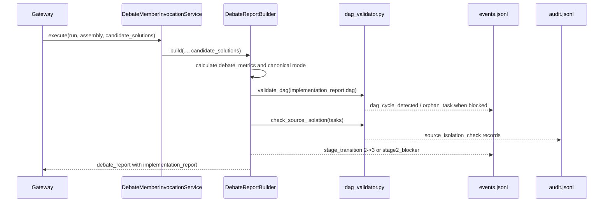
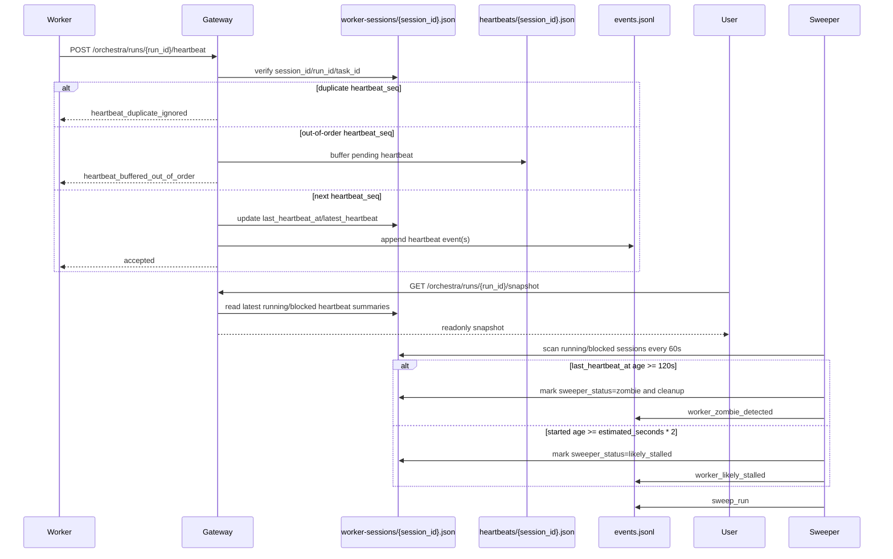

# Gateway Integration Architecture

## Goal

Define how Hermes Orchestra full-system modules integrate with the existing Python Gateway without modifying `scripts/lib/orch_gateway.py` during Sprint 0.

## Integration Mode

- Integration mode: import-and-call Python modules under `scripts/lib/`.
- Runtime owner: `GatewayApp` in `scripts/lib/orch_gateway.py` remains the only HTTP entrypoint.
- Module boundary: new modules expose plain Python classes with small public methods; Gateway owns request validation, persistence, and event emission.
- Execution boundary: no plugin callback system and no separate long-lived sidecar process in Sprint 0.

## Existing Gateway Integration Points

The current Gateway already exposes the seams later sprints need:

1. `GatewayApp.capabilities()` publishes config references and runtime capability metadata.
2. `GatewayApp.config_items(relative_path, key)` is the existing config-loading helper for debate registries.
3. `GatewayApp.validate_worker_pairing(options)` shows the current pattern for availability checks and clear validation errors.

These points imply that new modules should be called from Gateway methods, not from standalone CLIs or background daemons.

## Configuration Routing

- Default runtime path remains MVP until explicit cutover:
  - `config/debate/teams.json`
  - `config/debate/modes.json`
  - `config/workers/backends.json`
  - `config/workers/roles.json`
- Full-target packages are staged under `*/full/` and are opt-in only:
  - `config/debate/full/*.json`
  - `config/workers/full/*.json`
  - `config/release/*.json`
  - `config/knowledge/*.json`
- Routing rule:
  - Gateway default uses MVP registries.
  - Full-family modules may load `*/full/` config only when the caller explicitly selects the full package and the module passes feature-flag checks.
  - `config/cutover/full-readiness-gates.json` remains the source of truth for staged-vs-active policy.
  - `config/cutover/runtime-family-activation.json` may activate specific artifact families for default Gateway module dispatch without permitting a one-shot global cutover.

## Feature-Flag Contract

Every new module must enforce both checks before doing real work:

1. `enabled` check
   - If a module or backend config says `enabled: false`, return a clear error such as `module_disabled` or `backend_disabled`.
2. `package_status` check
   - If a full-target config has `package_status != "active"` and the caller did not explicitly allow staged validation/runtime use, return a clear error such as `package_not_active`.
3. Runtime activation override
   - Gateway may treat a staged family as default-runnable only when `config/cutover/runtime-family-activation.json` proves that family has satisfied the required cutover evidence and checks.
   - This override is family-scoped and must preserve mixed-family cutover; inactive families still require explicit `allow_staged`.

Allowed behavior for inactive modules:

- Return a no-op only when the sprint contract explicitly allows degradation.
- Otherwise fail fast with a clear machine-readable error.

## Public Module Interfaces

The module classes below are the contract for implementation sprints. Method names are intentionally small and concrete.

### Sprint 1

`class DebateEngine`

- `__init__(repo_root: Path, package_root: str = "config/debate/full", allow_staged: bool = False, enabled: bool = True) -> None`
- `load_registries() -> dict[str, Any]`
- `create_run(question: str, mode_id: str, selected_member_ids: list[str] | None = None, metadata: dict[str, Any] | None = None) -> dict[str, Any]`

### Sprint 2

`class DebateAssembly`

- `__init__(repo_root: Path, package_root: str = "config/debate/full", allow_staged: bool = False) -> None`
- `load_policy() -> dict[str, Any]`
- `select_for_stage(stage: str, task_type: str, risk_level: str, project_overrides: dict[str, Any] | None = None) -> dict[str, Any]`

### Sprint 3

`class DebateMemberInvoker`

- `__init__(backend_adapter: "DebateBackendAdapter") -> None`
- `build_invocation(member_id: str, question: str, input_refs: list[str], context: dict[str, Any]) -> dict[str, Any]`
- `invoke(invocation: dict[str, Any]) -> dict[str, Any]`

`class DebateBackendAdapter`

- `__init__(repo_root: Path, package_root: str = "config/debate/full", allow_staged: bool = False) -> None`
- `resolve_backend(backend_id: str) -> dict[str, Any]`
- `invoke(invocation: dict[str, Any]) -> dict[str, Any]`

`class DebateReportBuilder`

- `create_report(run_id: str, mode_id: str, opinions: list[dict[str, Any]], degraded: bool = False) -> dict[str, Any]`

### Sprint 4

`class WorkerRegistry`

- `__init__(repo_root: Path, package_root: str = "config/workers/full", allow_staged: bool = False) -> None`
- `load_backends() -> dict[str, Any]`
- `load_roles() -> dict[str, Any]`

`class CapabilityNegotiator`

- `__init__(registry: WorkerRegistry) -> None`
- `negotiate(role: str, requested_backend: str | None = None, required_capabilities: list[str] | None = None) -> dict[str, Any]`

### Sprint 5

`class WorkerSessionManager`

- `create_session(run_id: str, task_id: str, backend_id: str) -> dict[str, Any]`
- `transition(session_id: str, next_state: str, details: dict[str, Any] | None = None) -> dict[str, Any]`

`class WorkerSessionSweeper`

- `sweep(now: datetime | None = None) -> dict[str, Any]`

### Sprint 6

`class ReleasePipeline`

- `__init__(repo_root: Path, allow_staged: bool = False) -> None`
- `plan(environment: str) -> dict[str, Any]`
- `validate_command_refs() -> dict[str, Any]`

`class ReleaseExecutor`

- `execute(command_ref: str, approval_ref: str | None = None) -> dict[str, Any]`

`class DagValidator`

- `validate_dag(dag: dict, event_log_path: str | None = None) -> dict`
- `check_source_isolation(tasks: list[dict], audit_log_path: str | None = None) -> dict`

Second-stage solution debate calls these helpers from `DebateReportBuilder` after `DebateMemberInvocationService` receives `candidate_solutions` or an `implementation_report`. Gateway remains a facade: it validates request shape, forwards optional `event_log_path` / `audit_log_path`, and does not own DAG traversal or collision logic.



### Sprint 7

`class RuntimeKnowledgeBase`

- `__init__(repo_root: Path, allow_staged: bool = False) -> None`
- `query(request: dict[str, Any]) -> dict[str, Any]`

`class KnowledgeIngestion`

- `ingest(entry: dict[str, Any]) -> dict[str, Any]`

### Sprint 8

`class SelfEvolutionQueue`

- `enqueue(proposal: dict[str, Any]) -> dict[str, Any]`
- `list_pending() -> list[dict[str, Any]]`

`class PerformanceBudgetPolicy`

- `evaluate(component_id: str, observed: dict[str, Any]) -> dict[str, Any]`

### Sprint 9

`class FixturePolicy`

- `classify(source_ref: str) -> dict[str, Any]`

`class DegradationPolicy`

- `evaluate(evidence: dict[str, Any]) -> dict[str, Any]`

### Sprint 10

`class IdempotencyArchive`

- `record(command_id: str, payload: dict[str, Any]) -> dict[str, Any]`
- `fetch(idempotency_key: str) -> dict[str, Any] | None`

`class FullSchemaCutover`

- `evaluate_family(family_id: str) -> dict[str, Any]`
- `can_activate(family_id: str) -> dict[str, Any]`

## Call Pattern

- Gateway receives HTTP request.
- Gateway validates request shape and authority rules.
- Gateway instantiates the module class with `repo_root`.
- Module loads config through repository paths and enforces `enabled` / `package_status`.
- Module returns structured Python dictionaries.
- Gateway persists artifacts and events.

## Run Projection API

Gateway exposes Kimi-facing state projection without exposing raw Kanban mutation:

| Method | Path | Capability | Notes |
|---|---|---|---|
| GET | `/orchestra/runs/{run_id}/projection` | `hydrate_requirements` | Returns `run`, `tasks`, `artifacts`, `decisions`, `audits`, and `events`; response header `X-Projection-Schema-Version: 1.0.0`. |
| POST | `/orchestra/runs/{run_id}/projection` | `hydrate_requirements` | Refreshes projection for `stage_advance`, `heartbeat_sync`, `audit_rebuild`, or `manual_refresh`; invalid reasons return `invalid_refresh_reason`. |
| POST | `/orchestra/kanban/raw-state` | `mutate_kanban_raw_state` | Gateway-only raw Kanban mutation seam; Kimi receives `mutate_kanban_raw_state_blocked`. |

The projection is aggregated from existing Gateway file state: `run.json`, `tasks.json`, `events.jsonl`, `audit.jsonl`, command records, and run artifacts. It includes `run.intake_projection` with `original_intent_source`, numeric `confidence_score`, `conflict_summary`, and four-way `dependency_projection`.

## Actor Authentication

```mermaid
sequenceDiagram
    participant Actor
    participant Gateway
    participant Secrets as actor-secrets.json
    participant Matrix as authority-matrix.json
    Actor->>Gateway: Request + X-Actor-Token
    Gateway->>Secrets: Load active HMAC secret
    Gateway->>Gateway: Validate base64 payload, timestamp, HMAC, revoked token cache
    Gateway->>Matrix: Resolve capability status
    alt allowed
        Gateway-->>Actor: Execute route / return projection
    else blocked or undefined
        Gateway-->>Actor: 401/403 machine-readable error
    end
```

Actor tokens encode `actor_type`, `actor_id`, timestamp, HMAC signature, and optional L3/L4 approval claims. Valid actor types are `kimi`, `gateway`, `hermes_agents`, `claude_codex`, and `user`. Tokens expire after 300 seconds plus 30 seconds of clock skew.

## PRD 2.2 Capability Mapping

| Capability | Kimi | Gateway | Hermes Agents | Claude/Codex | User |
|---|---|---|---|---|---|
| `create_run` | allowed | allowed | blocked | blocked | allowed |
| `hydrate_requirements` | allowed | allowed | requires approval | requires approval | allowed |
| `mutate_kanban_raw_state` | blocked | allowed | blocked | blocked | blocked |
| `advance_stage` | requires approval | allowed | requires approval | requires approval | allowed |
| `select_debate_teams` | allowed | allowed | blocked | blocked | allowed |
| `code_or_review` | blocked | requires approval | allowed | allowed | allowed |
| `approve_l3_l4` | requires approval | blocked | blocked | blocked | allowed |
| `apply_self_evolution` | requires approval | blocked | blocked | blocked | allowed |

## Authority Trust Boundary

- Phase 2 trust model: actor-token capability enforcement for Projection and raw Kanban authority routes.
- The default Gateway deployment still binds to `127.0.0.1`.
- Non-loopback `--host` values are rejected unless the operator also passes `--allow-network-binding`.
- The `authority` field on `/orchestra/modules/*` remains an intent selector; Projection and Kanban authority routes additionally require `X-Actor-Token`.
- If Gateway is ever exposed beyond localhost, module endpoints should be moved behind the same token boundary or a stronger transport boundary such as mTLS.

## Sprint 9 Heartbeat, Snapshot, Sweeper Flow



Gateway facade responsibilities stay narrow:

- `POST /orchestra/runs/{run_id}/heartbeat` delegates validation, sequencing, buffering, session update, and event append to `HeartbeatHandler`.
- `GET /orchestra/runs/{run_id}/snapshot` delegates read-only aggregation to `HeartbeatHandler.snapshot`.
- `WorkerSessionSweeper.sweep_run(...)` remains separate from the HTTP server process and can be invoked by a supervisor, cron loop, or test harness.

## Non-Goals for Sprint 0

- No Gateway refactor.
- No automatic full-package activation.
- No separate process supervisor for debate, worker, release, or knowledge modules.
