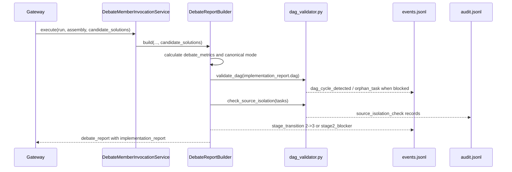
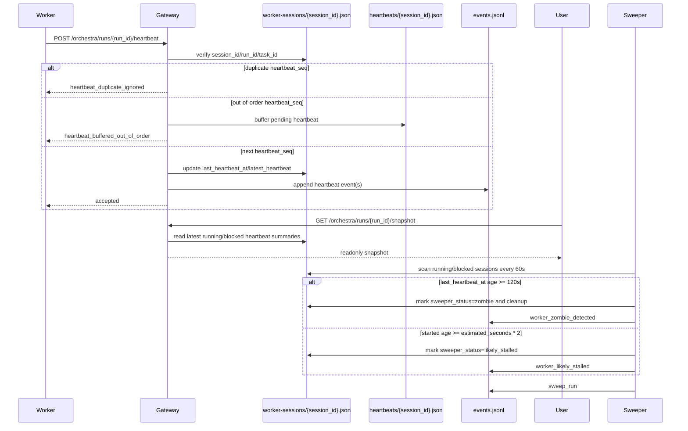

# Gateway Integration Architecture

## Goal

Define how Hermes Orchestra full-system modules integrate with the existing Python Gateway. This document started as the Sprint 0 integration baseline; later sections include subsequent Gateway additions such as Run Projection, actor-token authority, heartbeat/snapshot/sweeper behavior, and mixed-family runtime activation.

## Post-Sprint 0 Additions

This document is the Sprint 0 baseline plus subsequent additions. The current appendix layer (`## Cross-Sprint Contract Surfaces` + this section + `## Known Limitations (from sprint-overview.md)` + `## Plan Mapping Table`) is the audit-remediation-full alignment layer for the 13-sprint PRD compliance plan. Additions and surface changes:

| Addition | Reference |
|---|---|
| Run Projection API (with `X-Projection-Schema-Version: 1.0.0`) | `## Run Projection API` |
| Actor-token authority + 300s + 30s clock skew | `## Actor Authentication` |
| Heartbeat / snapshot / sweeper flow | `## Sprint 9 Heartbeat, Snapshot, Sweeper Flow` — actually Sprint 5 scope per `plan-sprint-5.md`; see `## Plan Mapping Table` |
| Mixed-family runtime activation | `## Configuration Routing` + `config/cutover/runtime-family-activation.json` |
| 14 public class blocks (Sprints 1-10) | `## Public Module Interfaces`; 2 are scope-drift flagged (see `## Plan Mapping Table`) |
| 6 Cross-Sprint Contract surfaces (Contracts 1-6) | `## Cross-Sprint Contract Surfaces` |
| Plan Mapping Table | `## Plan Mapping Table` (at end of doc) |
| Known Limitations (3 from `sprint-overview.md`) | `## Known Limitations (from sprint-overview.md)` (at end of doc) |
| `## Historical Sprint 0 Non-Goals` (negative list) | existing |

### Cross-Sprint Contract → Plan Mapping

| Contract | Producer | Consumers | Key shape |
|---|---|---|---|
| `conflict_ledger` | Sprint 1 | 2, 10, 13 | `conflicts[]` with 3 enums (type, severity, resolution) |
| `run.lifecycle_status` | Sprint 2 | 3, 4, 7, 8, 10 | 13 values + transition guard table |
| `run.channel_decision` | Sprint 4 | 5, 6 | 9 required fields incl. `forced_standard_reasons[]` |
| mini-debate report + `consensus_score` | Sprint 6 | 9 | `consensus_score` 0.60 threshold |
| `authority_route` + residual-risk | Sprint 10 | 11 | `residual_risks[]`, `approver_ref`, `notification_mode` |
| Sprint 12 → Sprint 13 gate scripts | Sprint 12 | 13 | schema/doc/metric gate scripts + evidence refs |

## Integration Mode

- Integration mode: import-and-call Python modules under `scripts/lib/`.
- Runtime owner: `GatewayApp` in `scripts/lib/orch_gateway.py` remains the only HTTP entrypoint.
- Module boundary: new modules expose plain Python classes with small public methods; Gateway owns request validation, persistence, and event emission.
- Execution boundary: no plugin callback system and no separate long-lived sidecar process in the original Sprint 0 baseline.

## Existing Gateway Integration Points

The current Gateway already exposes the seams later sprints need:

1. `GatewayApp.capabilities()` publishes config references and runtime capability metadata.
2. `GatewayApp.config_items(relative_path, key)` is the existing config-loading helper for debate registries.
3. `GatewayApp.validate_worker_pairing(options)` shows the current pattern for availability checks and clear validation errors.

These points imply that new modules should be called from Gateway methods, not from standalone CLIs or background daemons.

## Configuration Routing

- Default runtime path remains MVP until explicit cutover:
  - `config/debate/teams.json`
  - `config/debate/modes.json`
  - `config/workers/backends.json`
  - `config/workers/roles.json`
- Full-target packages are staged under `*/full/` and are opt-in only:
  - `config/debate/full/*.json`
  - `config/workers/full/*.json`
  - `config/release/*.json`
  - `config/knowledge/*.json`
- Routing rule:
  - Gateway default uses MVP registries.
  - Full-family modules may load `*/full/` config only when the caller explicitly selects the full package and the module passes feature-flag checks.
  - `config/cutover/full-readiness-gates.json` remains the source of truth for staged-vs-active policy.
  - `config/cutover/runtime-family-activation.json` may activate specific artifact families for default Gateway module dispatch without permitting a one-shot global cutover.

## Feature-Flag Contract

Every new module must enforce both checks before doing real work:

1. `enabled` check
   - If a module or backend config says `enabled: false`, return a clear error such as `module_disabled` or `backend_disabled`.
2. `package_status` check
   - If a full-target config has `package_status != "active"` and the caller did not explicitly allow staged validation/runtime use, return a clear error such as `package_not_active`.
3. Runtime activation override
   - Gateway may treat a staged family as default-runnable only when `config/cutover/runtime-family-activation.json` proves that family has satisfied the required cutover evidence and checks.
   - This override is family-scoped and must preserve mixed-family cutover; inactive families still require explicit `allow_staged`.

Allowed behavior for inactive modules:

- Return a no-op only when the sprint contract explicitly allows degradation.
- Otherwise fail fast with a clear machine-readable error.

## Public Module Interfaces

The module classes below are the contract for implementation sprints. Method names are intentionally small and concrete.

### Sprint 1 [SP: 5]

`class DebateEngine`

- `__init__(repo_root: Path, package_root: str = "config/debate/full", allow_staged: bool = False, enabled: bool = True) -> None`
- `load_registries() -> dict[str, Any]`
- `create_run(question: str, mode_id: str, selected_member_ids: list[str] | None = None, metadata: dict[str, Any] | None = None) -> dict[str, Any]`
  - Returns: dict with fields `{ run_id, mode_id, selected_member_ids, metadata }`. The `run_id` is the owner of subsequent `conflict_ledger` entries (see Cross-Sprint Contract 1).

### Sprint 2 [SP: 5]

`class DebateAssembly`

- `__init__(repo_root: Path, package_root: str = "config/debate/full", allow_staged: bool = False) -> None`
- `load_policy() -> dict[str, Any]`
- `select_for_stage(stage: str, task_type: str, risk_level: str, project_overrides: dict[str, Any] | None = None) -> dict[str, Any]`

### Sprint 3 [SP: 5]

`class DebateMemberInvoker`

- `__init__(backend_adapter: "DebateBackendAdapter") -> None`
- `build_invocation(member_id: str, question: str, input_refs: list[str], context: dict[str, Any]) -> dict[str, Any]`
- `invoke(invocation: dict[str, Any]) -> dict[str, Any]`

`class DebateBackendAdapter`

- `__init__(repo_root: Path, package_root: str = "config/debate/full", allow_staged: bool = False) -> None`
- `resolve_backend(backend_id: str) -> dict[str, Any]`
  - Returns: dict with fields `{ backend_id, backend_kind, available, reason_if_unavailable }`. The `backend_kind` is the model source consumed by `worker_session_record.model_source` (Sprint 7 source-isolation, see `schema.md` §`worker_session_record`).
- `invoke(invocation: dict[str, Any]) -> dict[str, Any]`

`class DebateReportBuilder`

- `create_report(run_id: str, mode_id: str, opinions: list[dict[str, Any]], degraded: bool = False) -> dict[str, Any]`
  - Returns: dict with fields `{ report_id, run_id, mode_id, debate_refs[], consensus_score, degraded }`. See Cross-Sprint Contract 5 for the canonical shape; the `consensus_score` 0.60 threshold gates Sprint 9 E-class disputes (`spec.md` FR-13).

### Sprint 4 [SP: 5]

`class WorkerRegistry`

- `__init__(repo_root: Path, package_root: str = "config/workers/full", allow_staged: bool = False) -> None`
- `load_backends() -> dict[str, Any]`
- `load_roles() -> dict[str, Any]`

`class CapabilityNegotiator`

- `__init__(registry: WorkerRegistry) -> None`
- `negotiate(role: str, requested_backend: str | None = None, required_capabilities: list[str] | None = None) -> dict[str, Any]`

### Sprint 5 [SP: 6]

> ⚠ **Scope drift note (audit P0-3)**: `WorkerSessionManager.transition` is not authorized by any `plan-sprint-N.md` (verified 2026-06-15). Retained for current behavior; see `## Plan Mapping Table` for relocation plan. **Fix docs only** — no method removal.

`class WorkerSessionManager`

- `create_session(run_id: str, task_id: str, backend_id: str) -> dict[str, Any]`
- `transition(session_id: str, next_state: str, details: dict[str, Any] | None = None) -> dict[str, Any]`

`class WorkerSessionSweeper`

- `sweep(now: datetime | None = None) -> dict[str, Any]`

### Sprint 6 [SP: 5]

`class ReleasePipeline`

- `__init__(repo_root: Path, allow_staged: bool = False) -> None`
- `plan(environment: str) -> dict[str, Any]`
- `validate_command_refs() -> dict[str, Any]`

`class ReleaseExecutor`

- `execute(command_ref: str, approval_ref: str | None = None) -> dict[str, Any]`

`class DagValidator`

- `validate_dag(dag: dict, event_log_path: str | None = None) -> dict`
- `check_source_isolation(tasks: list[dict], audit_log_path: str | None = None) -> dict`

Second-stage solution debate calls these helpers from `DebateReportBuilder` after `DebateMemberInvocationService` receives `candidate_solutions` or an `implementation_report`. Gateway remains a facade: it validates request shape, forwards optional `event_log_path` / `audit_log_path`, and does not own DAG traversal or collision logic.

```mermaid
sequenceDiagram
  participant Gateway
  participant Invocation as DebateMemberInvocationService
  participant Report as DebateReportBuilder
  participant DAG as dag_validator.py
  participant Events as events.jsonl
  participant Audit as audit.jsonl

  Gateway->>Invocation: execute(run, assembly, candidate_solutions)
  Invocation->>Report: build(..., candidate_solutions)
  Report->>Report: calculate debate_metrics and canonical mode
  Report->>DAG: validate_dag(implementation_report.dag)
  DAG-->>Events: dag_cycle_detected / orphan_task when blocked
  Report->>DAG: check_source_isolation(tasks)
  DAG-->>Audit: source_isolation_check records
  Report-->>Events: stage_transition 2->3 or stage2_blocker
  Report-->>Gateway: debate_report with implementation_report
```

### Sprint 7 [SP: 5]

`class RuntimeKnowledgeBase`

- `__init__(repo_root: Path, allow_staged: bool = False) -> None`
- `query(request: dict[str, Any]) -> dict[str, Any]`

`class KnowledgeIngestion`

- `ingest(entry: dict[str, Any]) -> dict[str, Any]`

### Sprint 8 [SP: 5]

`class SelfEvolutionQueue`

- `enqueue(proposal: dict[str, Any]) -> dict[str, Any]`
- `list_pending() -> list[dict[str, Any]]`

`class PerformanceBudgetPolicy`

- `evaluate(component_id: str, observed: dict[str, Any]) -> dict[str, Any]`

### Sprint 9 [SP: 6]

`class FixturePolicy`

- `classify(source_ref: str) -> dict[str, Any]`

`class DegradationPolicy`

- `evaluate(evidence: dict[str, Any]) -> dict[str, Any]`

### Sprint 10 [SP: 5]

`class IdempotencyArchive`

- `record(command_id: str, payload: dict[str, Any]) -> dict[str, Any]`
- `fetch(idempotency_key: str) -> dict[str, Any] | None`

> ⚠ **Scope drift note (audit P0-4)**: `FullSchemaCutover` belongs to Sprint 12 schema sync (per `plan-sprint-12.md` U14), not Sprint 10 (which is `gateway_evaluation.py` per `plan-sprint-10.md` U10). Retained at this anchor for now; see `## Plan Mapping Table` for relocation plan.

`class FullSchemaCutover`

- `evaluate_family(family_id: str) -> dict[str, Any]`
  - Returns: dict with fields `{ family_id, can_activate, gates_passed[], gates_failed[] }`. Belongs to Sprint 12 schema sync (see Cross-Sprint Contract 6 and the Plan Mapping Table in `## Plan Mapping Table`).
- `can_activate(family_id: str) -> dict[str, Any]`

## Cross-Sprint Contract Surfaces

The 13-sprint audit-remediation plan produces and consumes six cross-sprint contracts. These contracts are the producer/consumer interface that the original Sprint 0 baseline did not enumerate. They are referenced from `docs/sprints/prd-compliance-audit-remediation-full/sprint-overview.md` and the field shapes are defined in `docs/sprints/prd-compliance-audit-remediation-full/schema.md`.

### Contract 1 — `conflict_ledger` (Producer: Sprint 1; Consumers: Sprints 2, 10, 13)

- **Producer**: Sprint 1 (`plan-sprint-1.md` U1, 5 SP).
- **Consumers**: Sprint 2 (closeout audit reads ledger), Sprint 10 (residual-risk basis), Sprint 13 (final audit gate).
- **Artifact path**: `state://runs/{run_id}/conflict-ledger.json` (per `schema.md` Persistence).
- **Top-level required fields** (from `schema.md` §`conflict_ledger`):
  - `schema_version: string = "orchestra.full.v1"`
  - `artifact_type: string = "conflict_ledger"`
  - `run_id: string`
  - `conflicts[]: array` — each item: `conflict_id, run_id, stage, type, sources, severity, resolution, resolver, resolution_evidence, created_at, resolved_at`
- **Enums** (from `schema.md`):
  - `type`: `intent_vs_inference | fact_vs_assumption | cross_team_conflict | dependency_conflict | user_override`
  - `severity`: `high | medium | low`
  - `resolution`: `open | auto_resolved | accepted_risk | manual_resolved | superseded`
- **Surface status**: type definition lives in `schema.md`; this contract block is the only doc surface in `docs/`. No current public class method in this document enforces the schema (see `## Plan Mapping Table` for follow-up).

### Contract 2 — `run.lifecycle_status` + transition guard API (Producer: Sprint 2; Consumers: Sprints 3, 4, 7, 8, 10)

- **Producer**: Sprint 2 (`plan-sprint-2.md`, 5 SP).
- **Consumers**: Sprint 3 (rollback target state), Sprint 4 (channel routing input), Sprint 7 (worker source-isolation precondition), Sprint 8 (DAG validator precondition), Sprint 10 (veto decision).
- **Allowed values** (13, from `schema.md` §`run.lifecycle_status`):
  `created`, `intake_complete`, `direction_debate`, `solution_debate`, `implementation`, `improvement`, `global_evaluation`, `continuous_improvement`, `closed`, `paused`, `blocked`, `cancelled`, `rollback_requested`.
- **Transition Guard Table** (from `schema.md` L28-40):
  - `created` → `intake_complete`, `cancelled`
  - `intake_complete` → `direction_debate`, `cancelled`, `blocked`
  - `direction_debate` → `solution_debate`, `cancelled`, `blocked`, `rollback_requested`
  - `solution_debate` → `implementation`, `cancelled`, `blocked`, `rollback_requested`
  - `implementation` → `improvement`, `cancelled`, `blocked`, `rollback_requested`
  - `improvement` → `global_evaluation`, `cancelled`, `blocked`, `rollback_requested`
  - `global_evaluation` → `continuous_improvement`, `closed`, `cancelled`, `blocked`, `rollback_requested`
  - `continuous_improvement` → `closed`, `cancelled`, `blocked`, `rollback_requested`
  - `closed` → (terminal)
  - `paused` → `cancelled`; resume requires explicit `resume_lifecycle_status` or `previous_lifecycle_status` active target
  - `blocked` → `cancelled`; resume requires resolved blockers and explicit `resume_lifecycle_status` or `previous_lifecycle_status` active target
  - `cancelled` → (terminal)
  - `rollback_requested` → `implementation`, `cancelled`, `blocked`
- **Run Projection API impact**: the response schema in `## Run Projection API` includes `run.lifecycle_status` as a top-level field under `run` (see the L219 cell note).
- **Surface status**: this block is the first explicit field/guard declaration in `docs/`.

### Contract 3 — `run.channel_decision` (Producer: Sprint 4; Consumers: Sprints 5, 6)

- **Producer**: Sprint 4 (`plan-sprint-4.md`, 5 SP).
- **Consumers**: Sprint 5 (security escape forces `forced_standard`), Sprint 6 (mini-debate round count from `required_debate_rounds`).
- **Required fields** (9, from `schema.md` §`channel_decision`):
  - `channel: enum (quick | light | standard | deep)`
  - `reason: string`
  - `project_age_weeks: number`
  - `files_count: number`
  - `required_debate_rounds: number`
  - `required_evidence[]: array of evidence refs`
  - `forced_standard: bool`
  - `forced_standard_reasons[]: array of strings`
  - `decision_ref: string` (audit trail pointer)
- **Surface status**: zero class methods consume this schema in current doc; this block is the first surface. No code change implied (audit scope is docs only).

### Contract 4 — `authority_route` + residual-risk approval (Producer: Sprint 10; Consumer: Sprint 11)

- **Producer**: Sprint 10 (`plan-sprint-10.md` U10, 5 SP) — modifies `scripts/lib/gateway_evaluation.py`.
- **Consumer**: Sprint 11 (Override approval records use `authority_route` and `residual_risks` as approval preconditions).
- **Required fields** (from `spec.md` and `schema.md` §`override_record` companion):
  - `authority_route: string` (which authority chain must approve: e.g., `l4_user_only`, `l3_l4_kimi_user`, `auto_resolved_within_policy`)
  - `veto_dimensions[]: array` (one-vote veto scores from PRD policy)
  - `residual_risks[]: array` of `{severity: high|medium|low, action: string, authority_route: string}`
  - `approver_ref: string`
  - `notification_mode: enum (summary | full | none)`
- **Companion artifact**: `override_record` (Sprint 11 output) — required fields from `schema.md` L57-59: `override_id, run_id, correction_rounds[], override_category, risk_level, approver_ref, evidence_refs[], status, created_at, resolved_at`.
- **Surface status**: `## PRD 2.2 Capability Mapping` (L246-257) covers actor capability but not run-level `authority_route`. This contract block is the first run-level surface.

### Contract 5 — mini-debate report refs + `consensus_score` (Producer: Sprint 6; Consumer: Sprint 9)

- **Producer**: Sprint 6 (`plan-sprint-6.md`, 5 SP) — Quick/Light mini-debate integration.
- **Consumer**: Sprint 9 (E-class improvement disputes use this; `spec.md` FR-13: "Two-round E dispute flow blocks when consensus is below 0.60").
- **Required fields**:
  - `debate_refs[]: array of strings` (pointers to debate report artifacts)
  - `consensus_score: number` (range 0.0–1.0; **0.60 threshold** — Sprint 9 E-class blocks below this)
  - `degraded: bool` (whether bounded debate fell back to degraded mode)
- **Class surface**: `DebateReportBuilder.create_report(run_id, mode_id, opinions, degraded)` at L95. The existing block in `## Public Module Interfaces` (L93-95) cross-links to this contract; the typed shape annotation is the canonical reference.
- **Surface status**: this block is the first explicit field declaration in `docs/`.

### Contract 6 — Sprint 12 → Sprint 13 gate scripts + evidence refs (Producer: Sprint 12; Consumer: Sprint 13)

- **Producer**: Sprint 12 (`plan-sprint-12.md` U14, 3 SP) — Schema/docs/success metrics synchronization.
- **Consumer**: Sprint 13 (`plan-sprint-13.md`) — Final PRD compliance audit gate; consumes Sprint 12 evidence refs.
- **Key deliverables** (per `plan-sprint-12.md` U14):
  - Full schema reconciliation of additive fields (`config/schemas/orchestra.full.schema.json`)
  - Success metrics for conflict gate, rollback, channel escape, source isolation, final audit
  - Docs updated only for behavior actually implemented
  - `scripts/tests/test-prd-remediation-schema-doc-sync.sh` (per `schema.md` L68 Consistency Checks)
- **Required evidence refs** (Sprint 13 gate consumes):
  - Schema validation pass for all new fixture artifacts
  - Docs sync test pass (no missing schema references)
  - Strict e2e six-stage flow pass
  - Success metrics pipeline pass
- **Surface status**: `## Strict Gate Harness` in `docs/ARCHITECTURE.md` (L82) lists the scripts but does not yet declare Owner=Sprint 12 / Consumer=Sprint 13. This contract block is the canonical relationship reference.

## Call Pattern

- Gateway receives HTTP request.
- Gateway validates request shape and authority rules.
- Gateway instantiates the module class with `repo_root`.
- Module loads config through repository paths and enforces `enabled` / `package_status`.
- Module returns structured Python dictionaries.
- Gateway persists artifacts and events.

## Run Projection API

Gateway exposes Kimi-facing state projection without exposing raw Kanban mutation:

| Method | Path | Capability | Notes |
|---|---|---|---|
| GET | `/orchestra/runs/{run_id}/projection` | `hydrate_requirements` | Returns `run` (with `lifecycle_status` per Cross-Sprint Contract 2), `tasks`, `artifacts`, `decisions`, `audits`, and `events`; response header `X-Projection-Schema-Version: 1.0.0`. |
| POST | `/orchestra/runs/{run_id}/projection` | `hydrate_requirements` | Refreshes projection for `stage_advance`, `heartbeat_sync`, `audit_rebuild`, or `manual_refresh`; invalid reasons return `invalid_refresh_reason`. |
| POST | `/orchestra/kanban/raw-state` | `mutate_kanban_raw_state` | Gateway-only raw Kanban mutation seam; Kimi receives `mutate_kanban_raw_state_blocked`. |

The projection is aggregated from existing Gateway file state: `run.json`, `tasks.json`, `events.jsonl`, `audit.jsonl`, command records, and run artifacts. It includes `run.intake_projection` with `original_intent_source`, numeric `confidence_score`, `conflict_summary`, and four-way `dependency_projection`.

## Actor Authentication

```mermaid
sequenceDiagram
    participant Actor
    participant Gateway
    participant Secrets as actor-secrets.json
    participant Matrix as authority-matrix.json
    Actor->>Gateway: Request + X-Actor-Token
    Gateway->>Secrets: Load active HMAC secret
    Gateway->>Gateway: Validate base64 payload, timestamp, HMAC, revoked token cache
    Gateway->>Matrix: Resolve capability status
    alt allowed
        Gateway-->>Actor: Execute route / return projection
    else blocked or undefined
        Gateway-->>Actor: 401/403 machine-readable error
    end
```

Actor tokens encode `actor_type`, `actor_id`, timestamp, HMAC signature, and optional L3/L4 approval claims. Valid actor types are `kimi`, `gateway`, `hermes_agents`, `claude_codex`, and `user`. Tokens expire after 300 seconds plus 30 seconds of clock skew.

## PRD 2.2 Capability Mapping

| Capability | Kimi | Gateway | Hermes Agents | Claude/Codex | User |
|---|---|---|---|---|---|
| `create_run` | allowed | allowed | blocked | blocked | allowed |
| `hydrate_requirements` | allowed | allowed | requires approval | requires approval | allowed |
| `mutate_kanban_raw_state` | blocked | allowed | blocked | blocked | blocked |
| `advance_stage` | requires approval | allowed | requires approval | requires approval | allowed |
| `select_debate_teams` | allowed | allowed | blocked | blocked | allowed |
| `code_or_review` | blocked | requires approval | allowed | allowed | allowed |
| `approve_l3_l4` | requires approval | blocked | blocked | blocked | allowed |
| `apply_self_evolution` | requires approval | blocked | blocked | blocked | allowed |

## Authority Trust Boundary

- Phase 2 trust model: actor-token capability enforcement for Projection and raw Kanban authority routes.
- The default Gateway deployment still binds to `127.0.0.1`.
- Non-loopback `--host` values are rejected unless the operator also passes `--allow-network-binding`.
- The `authority` field on `/orchestra/modules/*` remains an intent selector; Projection and Kanban authority routes additionally require `X-Actor-Token`.
- If Gateway is ever exposed beyond localhost, module endpoints should be moved behind the same token boundary or a stronger transport boundary such as mTLS.

## Sprint 9 Heartbeat, Snapshot, Sweeper Flow

```mermaid
sequenceDiagram
    participant Worker
    participant Gateway
    participant Session as worker-sessions/{session_id}.json
    participant Buffer as heartbeats/{session_id}.json
    participant Events as events.jsonl
    participant User
    participant Sweeper

    Worker->>Gateway: POST /orchestra/runs/{run_id}/heartbeat
    Gateway->>Session: verify session_id/run_id/task_id
    alt duplicate heartbeat_seq
        Gateway-->>Worker: heartbeat_duplicate_ignored
    else out-of-order heartbeat_seq
        Gateway->>Buffer: buffer pending heartbeat
        Gateway-->>Worker: heartbeat_buffered_out_of_order
    else next heartbeat_seq
        Gateway->>Session: update last_heartbeat_at/latest_heartbeat
        Gateway->>Events: append heartbeat event(s)
        Gateway-->>Worker: accepted
    end

    User->>Gateway: GET /orchestra/runs/{run_id}/snapshot
    Gateway->>Session: read latest running/blocked heartbeat summaries
    Gateway-->>User: readonly snapshot

    Sweeper->>Session: scan running/blocked sessions every 60s
    alt last_heartbeat_at age >= 120s
        Sweeper->>Session: mark sweeper_status=zombie and cleanup
        Sweeper->>Events: worker_zombie_detected
    else started age >= estimated_seconds * 2
        Sweeper->>Session: mark sweeper_status=likely_stalled
        Sweeper->>Events: worker_likely_stalled
    end
    Sweeper->>Events: sweep_run
```

Gateway facade responsibilities stay narrow:

- `POST /orchestra/runs/{run_id}/heartbeat` delegates validation, sequencing, buffering, session update, and event append to `HeartbeatHandler`.
- `GET /orchestra/runs/{run_id}/snapshot` delegates read-only aggregation to `HeartbeatHandler.snapshot`.
- `WorkerSessionSweeper.sweep_run(...)` remains separate from the HTTP server process and can be invoked by a supervisor, cron loop, or test harness.

## Historical Sprint 0 Non-Goals

- No Gateway refactor.
- No automatic full-package activation.
- No separate process supervisor for debate, worker, release, or knowledge modules.

## Known Limitations (from `sprint-overview.md`)

The 13-sprint audit-remediation-full plan declares three explicit boundaries (`sprint-overview.md` L38-42):

- **Prior Conflict Ledger gate slice**: archived at `docs/archive/sprints/prd-compliance-audit-remediation/`. The current plan does not overwrite it; Sprint 1's `conflict_ledger` schema and closeout integration consume it.
- **DAG scope**: DAG work is scoped to **Gateway integration seam only** (consuming `scripts/lib/dag_validator.py` results as blocking advancement evidence). Low-level cycle detection already exists in `dag_validator.py` and is **not** in scope.
- **Rollback scope**: rollback implementation is limited to `current-run refs[]` (per `rollback_report.affected_refs[]` in `schema.md` L42-44). Must not touch unrelated branches or protected targets; `protected_target_check` is a required field in `rollback_report`.

## Plan Mapping Table

Reference: `docs/sprints/prd-compliance-audit-remediation-full/sprint-overview.md` Sprint Table.

This table is the authoritative cross-reference between the 13-sprint audit-remediation plan and the existing `### Sprint N` anchors in this document. The existing anchor titles are retained to preserve external links; new contract surfaces (in `## Cross-Sprint Contract Surfaces`) provide the producer/consumer relationship.

| Plan Sprint | Plan Focus | SP | This doc anchor | Status |
|---|---|---|---|---|
| 1 | Conflict Ledger | 5 | `### Sprint 1 [SP: 5]` | `DebateEngine` block; Contract 1 `conflict_ledger` added |
| 2 | Lifecycle state machine | 5 | `### Sprint 2 [SP: 5]` | `DebateAssembly` block; Contract 2 `run.lifecycle_status` added |
| 3 | Rollback strategy | 5 | `### Sprint 3 [SP: 5]` | `DebateMemberInvoker` / `DebateBackendAdapter` / `DebateReportBuilder` blocks; related to Contract 5 `consensus_score` |
| 4 | Channel routing | 5 | `### Sprint 4 [SP: 5]` | `WorkerRegistry` / `CapabilityNegotiator` blocks; Contract 3 `run.channel_decision` added |
| 5 | Security escape + heartbeat reconnect/snapshot | 6 | `### Sprint 5 [SP: 6]` | `WorkerSessionManager` ⚠ / `WorkerSessionSweeper` blocks; see Scope Drift Notes below |
| 6 | Quick/Light mini-debate | 5 | `### Sprint 6 [SP: 5]` | `ReleasePipeline` / `ReleaseExecutor` / `DagValidator` blocks; Contract 5 `consensus_score` added |
| 7 | Worker `model_source` source isolation | 5 | `### Sprint 7 [SP: 5]` | `RuntimeKnowledgeBase` / `KnowledgeIngestion` blocks; `model_source` field surfaced via `DebateBackendAdapter.resolve_backend` typed shape |
| 8 | Worker write-scope, DAG, review/commit evidence | 5 | `### Sprint 8 [SP: 5]` | `SelfEvolutionQueue` / `PerformanceBudgetPolicy` blocks |
| 9 | Intake completeness + E-class mini-debate | 6 | `### Sprint 9 [SP: 6]` | `FixturePolicy` / `DegradationPolicy` blocks; consumer of Contract 5 `consensus_score` 0.60 threshold |
| 10 | Veto + residual-risk | 5 | `### Sprint 10 [SP: 5]` | `IdempotencyArchive` / `FullSchemaCutover` ⚠ blocks; Contract 4 `authority_route` added |
| 11 | User correction / Override | 5 | (no anchor) | Pending — companion to Contract 4 via `override_record` |
| 12 | Schema/docs/metrics sync | 3 | (no anchor) | Plan owner; Contract 6 + `FullSchemaCutover` ⚠ should relocate here |
| 13 | Final PRD audit gate | 5 | (no anchor) | Consumer of Contract 6 evidence refs |

### Scope Drift Notes (this doc, not yet resolved)

The following class blocks in this document are **not authorized by any `plan-sprint-N.md`** (verified 2026-06-15 by `grep -l` across all 13 plan files, see audit `prd-compliance-docsync-review-2026-06-15.md` P0-3 / P0-4):

- `WorkerSessionManager.transition(session_id, next_state, details)` — see inline ⚠ at `### Sprint 5 [SP: 6]`. The class block was added in the Sprint 0 baseline before the 13-sprint remediation plan existed. **Retained** for current behavior; flagged for relocation or removal in a future doc-sync cycle. The closest contextual location would be Sprint 8 (Worker write-scope) but that plan does not enumerate this method.
- `FullSchemaCutover.evaluate_family(family_id)` / `can_activate(family_id)` — see inline ⚠ at `### Sprint 10 [SP: 5]`. Belongs to `plan-sprint-12.md` U14 (Schema/docs/metrics sync) per that file's "Files" list (`config/schemas/orchestra.full.schema.json`, `test-prd-remediation-schema-doc-sync.sh`). Not Sprint 10 (which is `gateway_evaluation.py` veto work per `plan-sprint-10.md` U10). **Relocate anchor**: future PR should move this class block to a new "Sprint 12 Schema Sync" anchor.

This table is the authoritative cross-reference. Existing `### Sprint N` block titles remain as-is to preserve anchors used by external links; do not rename them in this PR.
