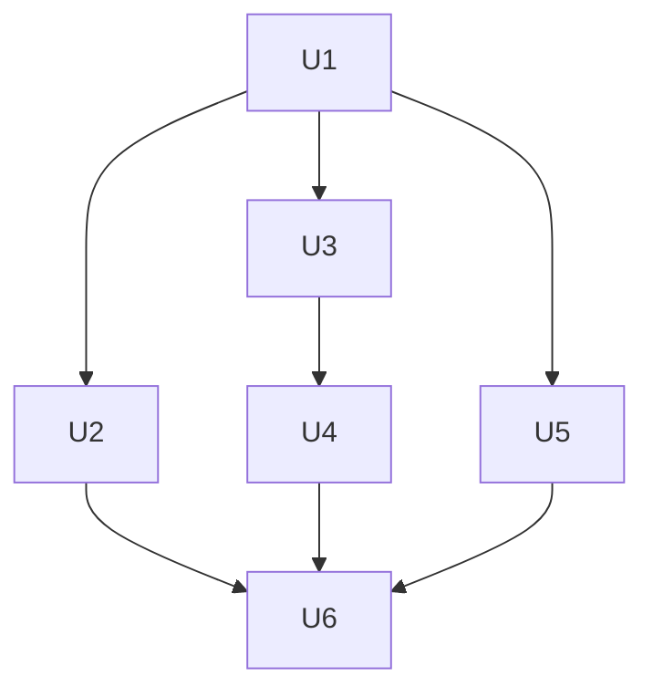

# Sprint 总览

## 概览

| Sprint | 故事点 | 任务数 | 容量利用率 |
|--------|--------|--------|------------|
| 1 | 7 SP | 2 项 | 100% |
| 2 | 7 SP | 2 项 | 100% |
| 3 | 7 SP | 2 项 | 100% |

## 需求覆盖

| 需求 | 覆盖 Sprint |
|------|-------------|
| R1 | Sprint 1 |
| R2 | Sprint 1 |
| R3 | Sprint 1 |
| R3 | Sprint 2 |
| R4 | Sprint 2 |
| R4 | Sprint 3 |
| R5 | Sprint 1 |
| R5 | Sprint 2 |
| R6 | Sprint 2 |
| R7 | Sprint 1 |
| R7 | Sprint 2 |
| R7 | Sprint 3 |
| R8 | Sprint 3 |

## 依赖关系图

