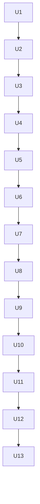

# Sprint 总览

## 概览

| Sprint | 故事点 | 任务数 | 容量利用率 |
|--------|--------|--------|------------|
| 1 | 5 SP | 1 项 | 71% |
| 2 | 5 SP | 1 项 | 71% |
| 3 | 5 SP | 1 项 | 71% |
| 4 | 5 SP | 1 项 | 71% |
| 5 | 5 SP | 1 项 | 71% |
| 6 | 5 SP | 1 项 | 71% |
| 7 | 5 SP | 1 项 | 71% |
| 8 | 5 SP | 1 项 | 71% |
| 9 | 5 SP | 1 项 | 71% |
| 10 | 5 SP | 1 项 | 71% |
| 11 | 5 SP | 1 项 | 71% |
| 12 | 5 SP | 1 项 | 71% |
| 13 | 5 SP | 1 项 | 71% |

## 需求覆盖

| 需求 | 覆盖 Sprint |
|------|-------------|
| R1 | Sprint 1 |
| R10 | Sprint 8 |
| R11 | Sprint 9 |
| R12 | Sprint 10 |
| R13 | Sprint 11 |
| R14 | Sprint 12 |
| R14 | Sprint 13 |
| R2 | Sprint 2 |
| R3 | Sprint 2 |
| R4 | Sprint 3 |
| R5 | Sprint 4 |
| R6 | Sprint 5 |
| R7 | Sprint 5 |
| R8 | Sprint 6 |
| R9 | Sprint 7 |

> **R14 拆分说明**：R14 拆分为 Sprint 12（protected target 审批 + 审计沉淀）和 Sprint 13（成功指标采集 + 严格回归），两个 Sprint 必须全部验收通过才视为 R14 完整覆盖。

## 依赖关系图

## 跨 Sprint 接口契约

U10 → U11 → U12 的输出/输入格式约束：

| 上游 | 输出产物 | 下游 | 输入约束 |
|------|----------|------|----------|
| U10 | `audit.jsonl` | U11 | 必须包含 `human_approval_ref` 才能纳入指标计算；缺少该字段的 protected target 变更视为未审批 |
| U10 | `self_evolution_queue` | U11 | 仅 `status=applied` 状态的建议计入"改进落地率"分子 |
| U11 | `success_metrics_summary.json` | U12 | `status=fail` 时必须阻塞回归 gate，禁止进入 0→6 阶严格回归 |
| U11 | `schema_consistency_report` | U12 | 差异列表非空时必须阻塞回归执行，必须先修复 schema 不一致再触发回归 |

## 容量调整说明

当前 Sprint 设计采用 5 SP / 1 项任务的粒度，这是基于 MVP 验证阶段的保守估算。实际执行时允许按真实工作量进行以下调整：

- **任务拆分**：单 Sprint 内可将 1 项任务拆分为 2–3 个子任务，每个子任务独立验收。
- **SP 扩容**：若实际评估超过 5 SP，允许扩容至 8 SP，但需在 Sprint 计划阶段显式记录扩容理由。
- **跨 Sprint 挪移**：若某 Sprint 未按期完成，允许将剩余工作挪移至下一个 Sprint，但必须在 `sprint-overview.md` 中更新依赖关系与风险说明。

