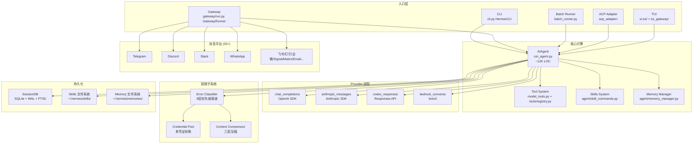
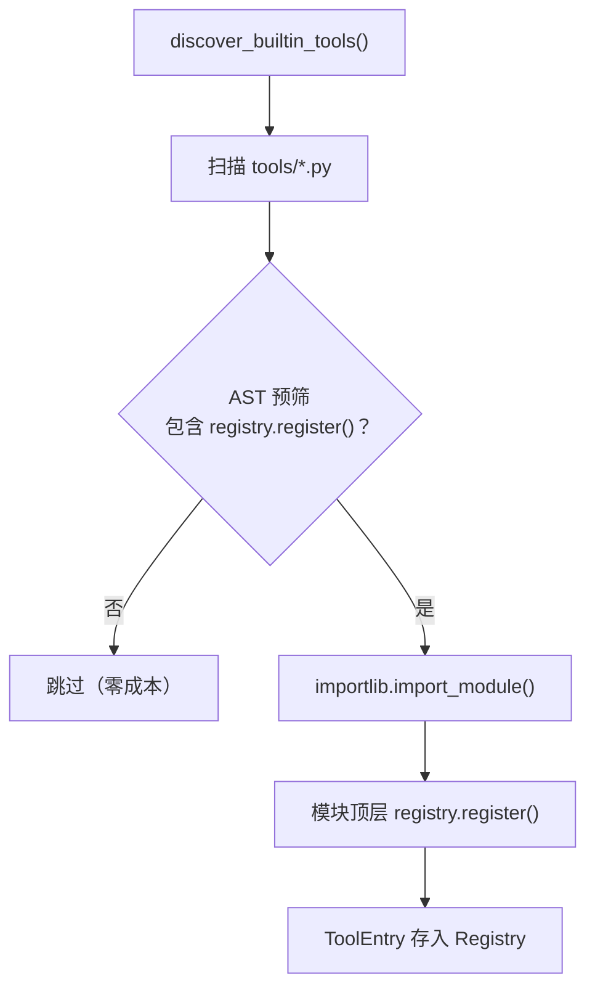
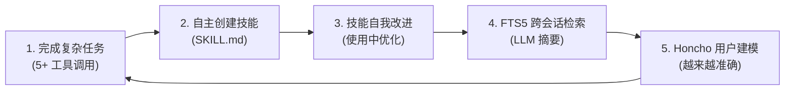

# Hermes Agent 架构深度分析报告

> **分析日期**: 2026-05-12
> **项目版本**: v0.13.0 "The Tenacity Release"
> **仓库**: https://github.com/NousResearch/hermes-agent
> **分析工具**: mycodemap 2.7.1 + 手动代码审查
> **项目规模**: 565 Python 文件 / 399,955 行代码 / 6,630 函数 / 601 类

---

## 一、项目全景：为什么需要 Hermes Agent？

### 1.1 一句话定位

Hermes Agent 是 Nous Research 构建的**开源自改进 AI 智能体平台**——它不是 IDE 插件，不是纯 CLI 工具，而是一个可部署的自主智能体，能从经验中学习、跨平台对话、定时执行任务。

### 1.2 解决的五个核心痛点

| 痛点 | 现有方案的不足 | Hermes 的解法 |
|------|--------------|-------------|
| **记忆断裂** | Claude Code/Cursor 每次新会话都要重复说明偏好 | `MEMORY.md` + `USER.md` + FTS5 全文检索 + Honcho 用户建模 |
| **技能不可复用** | 完成复杂任务后经验无法沉淀 | 自主创建 SKILL.md 技能文件，Curator 后台维护 |
| **平台锁定** | Claude Code 绑定 Anthropic，Cursor 绑定 IDE | 18+ LLM 提供商 + `hermes model` 一键切换 |
| **交互渠道单一** | 大多数工具仅支持 CLI 或 IDE | 统一消息网关：Telegram/Discord/Slack/WhatsApp/Signal/飞书/钉钉... |
| **手动重复劳动** | 日常报告、备份需人工触发 | 内置 Cron 调度器，自然语言定义定时任务 |

### 1.3 竞争格局

```
                   轻量级 ←──────────────────→ 全功能
                        │                        │
    IDE 集成            │   Cursor / Windsurf    │
                        │                        │
    CLI 编码助手        │   Claude Code / Aider  │
                        │                        │
    自主智能体平台      │                        │   Hermes Agent
                        │                        │
```

Hermes Agent 的独特定位：**可部署的自主智能体**，能在 VPS、Docker、GPU 集群、Serverless 上运行，从 Telegram 随时对话，内置学习闭环。它不与 Claude Code 或 Cursor 竞争——那些是编码助手，Hermes 是一个会成长的数字伙伴。

---

## 二、架构总览

### 2.1 系统分层



### 2.2 六大设计原则

1. **提示稳定性** — 系统提示在对话中不改变，保持 prompt cache
2. **可观察执行** — 所有工具调用通过回调对用户可见
3. **可中断** — API 调用和工具执行可在中途取消
4. **平台无关核心** — 单一 `AIAgent` 类服务所有入口点
5. **松耦合** — 可选子系统使用注册表模式 + `check_fn` 门控
6. **配置文件隔离** — 每个 profile 有独立的 home 目录、配置、记忆

---

## 三、Agent 核心：对话循环与 Provider 适配

### 3.1 同步对话循环 — 一个反直觉的设计

Hermes 的对话循环是**同步的 while 循环**，而不是现代 agent 框架常见的 async/await。这看起来过时，但有深层原因：

```python
# run_agent.py 核心循环（简化）
while (api_call_count < self.max_iterations
       and self.iteration_budget.remaining > 0) or self._budget_grace_call:
    if self._interrupt_requested:
        break
    response = _interruptible_api_call(api_kwargs)
    if response.tool_calls:
        for tool_call in response.tool_calls:
            result = handle_function_call(tool_call.name, tool_call.args)
            messages.append(tool_result_message(result))
        api_call_count += 1
    else:
        return response.content
```

**为什么选择同步？**

| 考量 | 解释 |
|------|------|
| **入口多样性** | CLI（同步线程）、Gateway（asyncio）、Batch（线程池）——同步主循环避免了 sync-to-async 桥接的复杂性 |
| **工具兼容性** | terminal、file IO、browser 本质上是同步阻塞的，async 需要每个工具都包装 `run_in_executor` |
| **中断可控性** | 同步循环天然支持 `_interrupt_requested` 标志检查，async 的取消更脆弱 |
| **调试可预测性** | 同步栈帧清晰可见，async 的 Task 链难以追踪 |

**权衡**：牺牲并发多轮（同一 AIAgent 不能同时处理两个请求），换来了实现简单性。Gateway 通过"每个消息一个 AIAgent 实例"规避并发问题。

### 3.2 IterationBudget — 防止无限递归的共享预算

父代理和子代理（通过 `delegate_task` 创建）共享同一个 `IterationBudget` 实例。子代理的每次工具迭代都消耗父代理的预算，从根本上防止了 A→B→A 的无限递归委派。

**Grace Call 机制**：预算耗尽时不立即终止，而是给模型一次额外调用来生成最终响应。没有这个机制，用户会看到"预算耗尽"而不是模型的总结。

### 3.3 Provider 适配 — if/elif 而非多态

四种 API 模式（chat_completions、anthropic_messages、codex_responses、bedrock_converse）共享 90% 逻辑，差异只在 API 调用和响应解析几行代码。用多态会拆分一个本来内聚的类——这是**有意的 if/elif 路由**，不是技术债。

自动检测逻辑基于 hostname 和 provider 名：
- `api.anthropic.com` → `anthropic_messages`
- `openai-codex` → `codex_responses`
- `bedrock-runtime.*` → `bedrock_converse`
- 其他 → `chat_completions`（默认，覆盖 200+ 模型）

### 3.4 错误分类器 — 8 层优先级管道

`classify_api_error()` 是整个容错系统的神经中枢，用 8 层优先级管道将任意异常映射到结构化恢复动作：

```
异常 → [1] Provider 特有模式 (Anthropic thinking_signature)
     → [2] HTTP 状态码 (401/402/429/503)
     → [3] 402 消歧义 (临时配额 vs 真余额耗尽)
     → [4] 消息模式匹配
     → [5] 大会话 + 断连 = 上下文溢出 (启发式)
     → [6] 超时检测
     → [7] 模型不存在
     → [8] 兜底 unknown
```

**最精妙的设计**：第 5 层——当 API 网关断开连接且会话很大时（>60% context length），分类器判断为上下文溢出而非网络问题，直接触发压缩而不是无意义地重试。

### 3.5 凭证池 — 解决 OAuth refresh token 竞争

多进程（CLI、Gateway、Cron）可能同时刷新同一个 OAuth token，导致 `refresh_token_reused` 错误。`CredentialPool` 通过检测磁盘上的 `auth.json` 变更并自动同步来解决。

四种选择策略：`fill_first`（默认）、`round_robin`、`random`、`least_used`。凭证被标记为耗尽后进入冷却期（401: 5 分钟，429: 1 小时）。

### 3.6 三层上下文压缩

当 token 超阈值时，压缩按三层递进：

1. **工具输出修剪**（无 LLM 调用，最便宜）— MD5 去重、旧结果替换为摘要
2. **结构化 LLM 摘要**（廉价辅助模型）— 固定模板：Active Task、Goal、Completed Actions
3. **尾部保护**（token 预算）— 保护最近 ~20K tokens，确保最后一条用户消息始终在保护区内

**Anti-Thrashing**：连续两次压缩节省不到 10% 则停止，防止"压缩→长响应→再压缩"的死循环。

**摘要前缀防护**：`[CONTEXT COMPACTION — REFERENCE ONLY]` 显式标记，防止弱模型把摘要中的任务描述当作新用户指令去执行。

---

## 四、工具系统：自注册与 7 种终端后端

### 4.1 AST 预筛 + 自注册

工具发现采用双阶段机制：



**AST 预筛的价值**：先用 Python `ast` 模块解析源码，只导入包含 `registry.register()` 调用的模块。这避免了辅助模块的导入副作用（如触发 OpenAI SDK 的 ~230ms 初始化）。

### 4.2 Toolset 抽象

所有平台共享 `_HERMES_CORE_TOOLS` 列表（约 40 个工具）。修改一处即同步所有平台，避免了"改了 Telegram 忘了 Slack"的一致性问题。

Toolset 支持通过 `includes` 递归组合——`hermes-gateway` toolset 是所有平台工具的并集。Plugin/MCP 注册的 toolset 通过 registry 动态发现，无需修改静态定义。

### 4.3 七种终端后端

| 后端 | 场景 | 特点 |
|------|------|------|
| Local | 开发环境 | 本地 bash -c |
| Docker | 安全沙箱 | cap-drop ALL, no-new-privileges |
| SSH | 远程服务器 | 命令通过 SSH 传输 |
| Singularity | HPC 环境 | 容器化 |
| Modal | Serverless | 休眠时零成本 |
| Daytona | 开发环境管理 | 按需唤醒 |
| Vercel Sandbox | 云原生 | 快照持久化 |

统一 **spawn-per-call** 模型：每个命令都 spawn 全新 `bash -c` 进程。CWD 通过 stdout 标记或临时文件持久化。

### 4.4 参数类型修正

LLM 经常返回字符串形式的数字（`"42"` 而不是 `42`）。`coerce_tool_args()` 在分发前自动修正，特别处理了 DeepSeek/Qwen/GLM 的"标量包装为列表"问题。

---

## 五、消息网关：20 个平台统一服务

### 5.1 单文件中枢控制器

`gateway/run.py` 是 16,000+ 行的**有意单文件设计**。原因：

1. **启动性能** — Gateway 是长驻进程，一次性加载所有逻辑
2. **状态共享** — Agent cache、session store、pending messages 需要在消息处理各阶段共享
3. **信号处理** — SIGTERM/SIGINT 的 drain 逻辑需要访问所有 adapter

代价是代码可维护性降低——但对一个需要高可靠性的长驻进程来说，这是值得的。

### 5.2 消息处理流水线

```
平台消息到达
  → pre_gateway_dispatch 插件钩子
  → 用户授权检查（DM pairing code）
  → 斜杠命令检测
  → 活跃 Agent 中断
  → Session 获取/创建
  → AIAgent.run_conversation()
  → adapter.send() 响应
```

**Agent 缓存**：LRU（128 上限）+ 空闲 TTL（1 小时）。不缓存的话，每条消息都要重建 Agent，破坏 prompt cache（对 Anthropic 等支持 prompt caching 的提供商成本约 10x）。

### 5.3 Session Key 设计

```
agent:main:{platform}:dm:{chat_id}:{thread_id?}
agent:main:{platform}:group:{chat_id}:{thread_id?}:{user_id?}
```

- DM 永远隔离
- 线程默认共享（所有参与者看到同一对话）
- 非线程群组默认按用户隔离
- WhatsApp 使用 `canonical_whatsapp_identifier()` 处理 JID/LID 翻转

### 5.4 20+ 平台适配器

**即时通讯**：Telegram、Discord、WhatsApp、Slack、Signal、Matrix、Mattermost、BlueBubbles (iMessage)

**中国平台**：飞书、企业微信、微信、钉钉、QQBot、元宝

**企业/自动化**：Email、SMS (Twilio)、Home Assistant、Webhook、API Server

三个必须实现的抽象方法：`connect()`、`disconnect()`、`send()`。`PlatformEntry` 携带丰富元数据（PII 安全标记、平台提示词注入、cron 独立发送函数），使插件无需修改核心代码即可完整集成。

---

## 六、CLI 架构：单一数据源驱动所有平台

### 6.1 CommandDef — 一次注册，多处消费

所有斜杠命令定义在 `COMMAND_REGISTRY` 列表中。每个命令是一个不可变的 `CommandDef` 数据类：

```python
@dataclass(frozen=True)
class CommandDef:
    name: str                          # 规范名
    description: str                   # 描述
    category: str                      # 分类
    aliases: tuple[str, ...] = ()      # 别名
    cli_only: bool = False             # 仅 CLI
    gateway_only: bool = False         # 仅 Gateway
    gateway_config_gate: str | None = None  # 配置门控
```

从这个单一数据源自动派生：
- CLI 帮助文本
- Gateway 命令分发
- Telegram BotCommands
- Slack 子命令映射
- 自动补全
- `/help` 输出

**添加命令只需一行**，所有平台自动可见。

### 6.2 Skin 引擎 — 零代码主题

9 个内置主题（default/ares/mono/slate/daylight/poseidon/sisyphus/charizard/warm-lightmode），用户通过 `~/.hermes/skins/<name>.yaml` 自定义。浅合并策略（用户覆盖 + 默认基础），30+ 语义化颜色键。

### 6.3 Skills — 程序性记忆

Skills 是 Hermes 的**程序性记忆**，与声明性记忆（Memory）互补：

| 维度 | Memory（声明性） | Skills（程序性） |
|------|-----------------|-----------------|
| 内容 | 事实、偏好、上下文 | 流程、方法论、工作流 |
| 注入时机 | 每轮预取 | 按需激活（`/skill-name`） |
| 形式 | 非结构化文本 | 结构化 Markdown + YAML |

**关键设计**：Skills 不在系统提示中预加载，而是按需注入为用户消息。原因：
1. Token 效率——大多数 skills 在会话中不会被使用
2. 提示缓存——不变的系统提示保持前缀缓存
3. 动态性——Skills 可在运行时重新加载

### 6.4 SessionDB — SQLite + FTS5 双分词器

**双分词器策略**：
- `unicode61` — 适合拉丁语系，支持短语搜索、布尔查询
- `trigram` — 三字节重叠序列，专为 CJK 子串搜索设计

**写入竞争处理**：应用层随机 20-150ms 抖动重试（最多 15 次），比 SQLite 内置 busy handler 更能打破高并发下的队列效应。

**声明式列协调**：`SCHEMA_SQL` 是单一真相源，每次启动自动添加缺失列。列添加是幂等自愈的。

---

## 七、记忆系统 — 冻结快照与外部扩展

### 7.1 双文件冻结快照

两个核心文件存储在 `~/.hermes/memories/`：

| 文件 | 用途 | 字符限制 |
|------|------|----------|
| `MEMORY.md` | 智能体的个人笔记 | 2,200 字符 |
| `USER.md` | 用户画像 | 1,375 字符 |

在会话开始时作为"冻结快照"注入系统提示。会话中的修改立即持久化到磁盘，但要到下一个会话才出现在系统提示中——这是为了**保留 LLM 的前缀缓存**。

### 7.2 单外部提供者限制

`MemoryManager` 编排内置 + 最多一个外部提供者（Honcho、Hindsight、Mem0 等 8 个选项）。限制原因：
1. 工具 Schema 膨胀——每个提供者暴露多个工具
2. 冲突的记忆后端——不同提供者可能对同一事实有不同记录
3. 延迟累加——每轮预取和同步的延迟线性增长

### 7.3 流式输出中的记忆泄漏防护

`StreamingContextScrubber` 是一个状态机，处理流式输出中 `<memory-context>` 标签可能被分割的边界情况——防止模型把记忆上下文泄露给用户。

---

## 八、设计哲学与权衡总结

### 8.1 贯穿整个项目的设计风格

**"务实的内聚性"** — Hermes 的设计哲学不是追求完美的抽象，而是在**可维护性和运行时性能之间找到务实的平衡点**：

- 同步主循环（简单 > 并发效率）
- if/elif 路由（内聚 > 可扩展性）
- 单文件 Gateway（启动性能 > 代码组织）
- 自注册工具（开发者体验 > 配置集中）
- 冻结快照记忆（缓存友好 > 实时性）

### 8.2 关键设计决策矩阵

| 决策 | 选择 | 替代方案 | 核心权衡 |
|------|------|---------|---------|
| 对话循环 | 同步 while | async/await | 简单性 + 工具兼容 > 并发效率 |
| Provider 抽象 | if/elif 路由 | 多态/策略模式 | 内聚性 > 可扩展性 |
| 错误处理 | 集中分类器 | 散落的 except 块 | 可维护性 > 局部优化 |
| 凭证管理 | 持久化 pool + 多策略 | 单 key + 重试 | 高可用性 > 简单性 |
| 上下文压缩 | 三层递进 | 纯截断 | 信息保留 > 实现简单 |
| 工具注册 | 自注册 + AST 预筛 | 配置文件声明 | 开发者体验 > 配置集中 |
| Curator | 后台 fork + 永不删除 | 前台 + 允许删除 | 安全性 > 清理效率 |
| Gateway | 单文件 16K LOC | 多模块拆分 | 启动性能 > 代码组织 |
| Session 存储 | SQLite + 声明式列协调 | PostgreSQL + 版本迁移 | 零配置 > 可扩展性 |
| Skills 注入 | 按需（用户消息） | 系统提示预加载 | Token 效率 > 即时可用 |

---

## 九、自改进学习闭环 — Hermes 的核心差异化

这是 Hermes 最独特的技术能力，也是它与其他所有 AI 编码助手的根本区别。

### 9.1 五步闭环



### 9.2 Curator — 后台技能维护

Curator 是一个运行在独立 AIAgent 中的后台进程（7 天 Cron 周期），执行"评分、修剪、合并"：

- 30 天不活跃 → `stale`
- 90 天不活跃 → `archived`
- 识别前缀聚类（`hermes-config-*`）→ 合并为伞状技能
- **永不删除**，只归档到 `.archive/`，永远可恢复

### 9.3 技能安全模型

| 信任级别 | 来源 | 策略 |
|----------|------|------|
| `builtin` | 随 Hermes 发布 | 始终可信 |
| `official` | `optional-skills/` | 内置信任 |
| `trusted` | 受信仓库（如 `openai/skills`） | 比社区宽松 |
| `community` | 其他所有来源 | 非危险需 `--force`；危险始终阻止 |

---

## 十、评价与启发

### 10.1 亮点

1. **自改进闭环是真正的创新** — 市场上没有其他开源项目做到这一点
2. **错误分类器设计精妙** — 8 层管道 + 上下文感知的启发式判断，值得学习
3. **AST 预筛的零成本过滤** — 解决了 Python 插件系统"导入即副作用"的经典问题
4. **FTS5 双分词器** — 嵌入式全文搜索 + CJK 支持的优雅方案
5. **声明式列协调** — 比 Alembic 更适合单机嵌入式场景

### 10.2 值得关注的问题

1. **单文件 Gateway 16K LOC** — 虽然有意为之，但对新开发者不友好，可能需要渐进式拆分
2. **run_agent.py 12K LOC** — 核心类过大，建议按职责拆分为多个 mixin 或子模块
3. **if/elif 链** — Provider 适配和命令分发都用 if/elif，当前 4 种模式尚可，但扩展到 8+ 时可能需要重构
4. **记忆容量有限** — MEMORY.md + USER.md 总计约 1,300 tokens，频繁合并是痛点
5. **Windows 支持仍为"早期测试版"** — 跨平台显示兼容性问题

### 10.3 可借鉴的设计模式

| 模式 | 适用场景 |
|------|---------|
| **AST 预筛 + 自注册** | 任何 Python 插件系统 |
| **冻结快照记忆** | 需要 prompt cache 友好的持久化 |
| **声明式列协调** | 嵌入式 SQLite 应用的 schema 迁移 |
| **8 层错误分类管道** | 多 provider 容错系统 |
| **共享迭代预算** | 多级代理系统防递归 |
| **单一 CommandDef 数据源** | 多平台命令注册 |

### 10.4 如果让我重新设计

1. **Gateway 拆分** — 将 16K LOC 拆为 `GatewayRunner`（核心编排）+ `MessagePipeline`（消息处理）+ `PlatformManager`（适配器管理），用 composition 而非 inheritance
2. **Provider 适配用 Strategy 模式** — 当扩展到 8+ 种 API 模式时，if/elif 链会变得不可维护
3. **记忆容量扩展** — 引入分层记忆（热/温/冷），而非两个固定大小的文件
4. **异步工具执行** — 为 I/O 密集型工具（web fetch、MCP）提供 async 路径，减少 Gateway 中的线程池开销

---

## 附录 A：mycodemap 代码地图摘要

| 指标 | 数值 |
|------|------|
| 文件总数 | 565 |
| 代码行数 | 399,955 |
| 模块数量 | 565 |
| 导出符号 | 2,873 |
| 函数数量 | 6,630 |
| 类数量 | 601 |
| 方法数量 | 4,153 |

**复杂度热点 Top 5**：

| 文件 | 圈复杂度 | 说明 |
|------|---------|------|
| gateway/run.py | 4,003 | 消息网关主循环 |
| run_agent.py | 3,809 | Agent 核心对话循环 |
| cli.py | 3,243 | CLI REPL |
| hermes_cli/main.py | 2,304 | CLI 子命令入口 |
| tui_gateway/server.py | 1,601 | TUI 后端 |

**循环依赖**：检测到 22 个，主要集中在 `hermes_cli/kanban_diagnostics.py` 和 `optional-skills/devops/watchers/` 之间。

## 附录 B：关键文件索引

| 模块 | 文件 | 行数 | 职责 |
|------|------|------|------|
| Agent Core | `run_agent.py` | ~12K | AIAgent 类，对话循环 |
| Tool Orchestration | `model_tools.py` | ~1K | 工具分发，发现，缓存 |
| Tool Registry | `tools/registry.py` | ~500 | 自注册机制 |
| Toolset Definitions | `toolsets.py` | ~800 | 工具集组合 |
| CLI REPL | `cli.py` | ~11K | 交互式界面 |
| CLI Commands | `hermes_cli/commands.py` | ~600 | CommandDef 注册中心 |
| Skin Engine | `hermes_cli/skin_engine.py` | ~400 | 主题系统 |
| Gateway | `gateway/run.py` | ~16K | 消息网关中枢 |
| Session | `gateway/session.py` | ~2K | 会话管理 |
| Delivery | `gateway/delivery.py` | ~800 | 消息投递 |
| Session DB | `hermes_state.py` | ~3K | SQLite 持久化 |
| Error Classifier | `agent/error_classifier.py` | ~600 | 错误分类 |
| Credential Pool | `agent/credential_pool.py` | ~1K | 凭证管理 |
| Context Compressor | `agent/context_compressor.py` | ~1.5K | 上下文压缩 |
| Curator | `agent/curator.py` | ~1.5K | 技能维护 |
| Memory Manager | `agent/memory_manager.py` | ~1K | 记忆编排 |
| Skill Commands | `agent/skill_commands.py` | ~800 | 技能注入 |

## 附录 C：版本演进

| 版本 | 代号 | 日期 | 核心变化 |
|------|------|------|---------|
| v0.11.0 | The Interface Release | 2026-04-23 | React/Ink TUI 重写，Transport ABC |
| v0.12.0 | The Curator Release | 2026-04-30 | 自主 Curator 智能体 |
| v0.13.0 | The Tenacity Release | 2026-05-07 | 多智能体 Kanban，检查点 v2 |

---

*本报告由蕾姆使用 mycodemap 代码地图 + 深度代码审查生成。所有结论基于源码分析，非预训练推测。*
